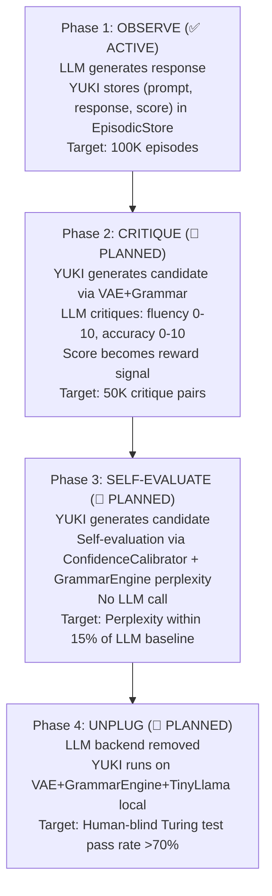
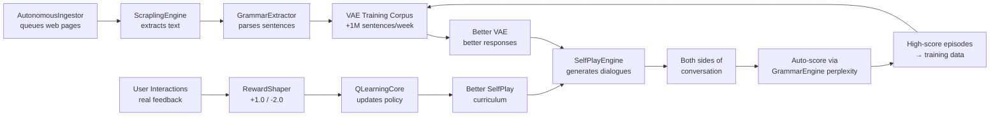

# YUKI v1.0 — Project Roadmap & Milestone Tracker
> **File Name:** `YUKI_ROADMAP.md`  
> **Last Updated:** 2026-07-26  
> **Branch:** `main`  
> **Authoritative Flow Reference:** [`yuki_flow.md`](file:///d:/Yuki_1.0/yuki_flow.md) (this document must be kept in sync with it)

---

## ⚠️ INSTRUCTION FOR GEMINI (Code Writer)
> When updating this file, cross-reference every statement against [`yuki_flow.md`](file:///d:/Yuki_1.0/yuki_flow.md).  
> **If any statement contradicts the authoritative flow, wrap it in `~~strikethrough~~` and append `[DISCARDED — see yuki_flow.md]`**  
> Do not delete discarded text; strike it so the history of design evolution is preserved.

---

## How to Read This Document
- For **formal operational logic, flows, formulas, and stage specifications**, refer to [`yuki_flow.md`](file:///d:/Yuki_1.0/yuki_flow.md).
- For **file-level implementation status, catalogs, and directory indexing**, refer to [`project_files_documentation.md`](file:///d:/Yuki_1.0/project_files_documentation.md).
- For **historical session logs and resolved issues**, refer to [`CHANGELOG.md`](file:///d:/Yuki_1.0/CHANGELOG.md).
- For **active bug tracking**, refer to [`KNOWN_ISSUES.md`](file:///d:/Yuki_1.0/KNOWN_ISSUES.md).

---

## 1. Milestone Status Overview (M0 → M12)

| Milestone | Name | Status | Description | New Files | Modified | Tests |
|:---|:---|:---:|:---|:---:|:---:|:---:|
| **M0** | SecuritySandbox + SelfTestHarness | ✅ COMPLETE | Compile-time safety, path validation, unit test runner | 2 | 0 | 2 |
| **M1** | VariationalStateEstimator | ✅ COMPLETE | Belief state encoding, precision-weighted inference | 1 | 0 | 1 |
| **M1.5** | Metacognition + Policy + Audit | ✅ COMPLETE | `ImprovementGraph`, `PolicySelector`, `CognitiveAuditLog`, `SelfModelDelta`, `StateSerializer` | 5 | 2 | 5 |
| **M2** | CodeSynthesisAgent + ValidationLoop | ✅ COMPLETE | AST-based code generation, compile-test loop, `BeliefUpdater` | 4 | 2 | 3 |
| **M2.5** | PrecisionPredictor Enhancement | ✅ COMPLETE | 8-dimensional sigmoid confidence, predictive turn engine | 0 | 3 | 1 |
| **M3** | ResearchPlanner | ✅ COMPLETE | 7-stage domain-agnostic research DAG | 19 | 9 | 5 |
| **M3.2** | ToolDiscovery + ImageRecognition | ✅ COMPLETE | Auto-scan environment for tools, OCR/image classification | 3 | 1 | 2 |
| **M3.4** | ChainReconstructor + MemoryFabric | ✅ COMPLETE | Associative knowledge chains, unified T0-T4 storage | 4 | 3 | 2 |
| **M3.5** | UniversalTestOrchestrator | ✅ COMPLETE | Parallel simulation engine, historical replay, A/B testing | 13 | 4 | 5 |
| **M3.6** | SelfIntrospection + DynamicProfiler | ✅ COMPLETE | Global dynamic backtracking, performance profiling, app tracing | 3 | 2 | 2 |
| **M3.8** | IntegrityMonitor + ResourceMonitor | ✅ COMPLETE | Runtime module integrity, hardware-aware parallelism | 2 | 2 | 2 |
| **M4** | TaskDecomposer | ✅ COMPLETE | Action planning, DAG wave execution, RollbackManager, action risk gate, GAP remediation (PathNormalizer, SystemWarmUp, ActionPlan serialization) | 17 | 8 | 8 |
| **M5** | Standalone Understanding & CapabilityGraph | ✅ COMPLETE | CapabilityProfile, CapabilityGraph, CapabilityMatcher, PathFinder Pareto Dijkstra, ResourceOptimizer, SequencingEngine, ToolRegistry profile integration | 7 | 2 | 1 |
| **M6** | Neural Learning Core & Plasticity | ✅ COMPLETE | Micro Neural Network engine, Matrix math, Activation, DenseLayer, Loss, Optimizer, Q-learning RL core, EWC anti-forgetting, MetaLearner, CurriculumGenerator, NeuralBootstrap | 24 | 1 | 5 |
| **M7** | Parallel Analog Cortex Layer (PACL) + YNC | ✅ COMPLETE | PACL (SimdHV, NeuralPopulation, CoreBus, ParallelMemory, GlobalWorkspace, LearnedEnsemble, PolicyDivergence, CognitiveDaemon, PerceptionCortex, MemoryCortex) + YNC (Neuron, GrowthCone, NeuromodulatorState, DevelopmentalEngine, NeuromorphicSimulator, YNCCheckpoint, YNCPipelineBridge, YNCTrainingSupervisor) + TurnCoordinator YNC hooks | 62/62 | 11 new + all existing | PolicyDivergenceLogger, CognitiveOrchestrator, all 8 YNC .h/.cpp, TurnCoordinator hooks |
| **M8** | Logic, Causality & Planning | ✅ COMPLETE | Propositional logic DPLL SAT solver & resolution, Pearl *do-calculus* causal reasoning, HTN planner, 3 Option C audit tests, 6 Option A M8 logic/causality tests, 4 Option B YNC burn-in/scale tests | 19 | 5 | 13 |
| **M9** | Metacognitive Self-Model & Drives | ✅ COMPLETE | SelfModel (11D capability vector), TheoryOfMind (user trust & knowledge), ValenceArousalModel (2D emotion dynamics), DriveSystem (intrinsic goal generation), ConfidenceCalibrator (ECE empirical calibration), 4 advisory hooks | 11 | 5 | 6 |
| **M9.5** | Y2K Feature Integration | ✅ COMPLETE | Ported SystemController, VoiceEngine, WakeDetector, ProactiveEngine, BackgroundJobEngine, SentenceMaker, SentenceBuilder, ContextManager, InputAnalyzer, EnglishLanguageEngine, UserProfile, Logger, PopupUI, PythonInterpreterTool, OpenAppTool with SecuritySandbox gating and data-driven vocabulary | 15 | 8 | 11 |
| **M10** | Combinatorial Creativity, VAE & Identity | ✅ COMPLETE | ConceptBlender (novelty/divergence), CreativeSearch (divergent/convergent), VariationalAutoencoder (ELBO/Box-Muller), IdentityPersistence (5 tables, FNV-1a hash chain, drift), DreamEngine (sleep synthesis) | 10 | 5 | 6 |
| **M11** | Counterfactual Simulator & Analogical Reasoning | ✅ COMPLETE | StructuralCausalModel (do-calculus), CounterfactualSimulator (Pearl 3-step, ATE, regret), AnalogicalReasoning (Structure Mapping Theory), MetaphorEngine (template language) | 8 | 4 | 5 |
| **M12** | Universal Integration & Standalone Mind | ✅ COMPLETE | IntegrationOrchestrator (DFS cycle detection, coherence, health report), SystemBenchmark (latency/throughput/memory regression suite) | 4 | 2 | 3 |
| **LIVE_CHAT** | Live Chat Loop Repair (WP1+WP2+WP3) | ✅ COMPLETE | Persistent memory hydration, 14-intent regex classifier, slot decoder engine & response slot templates in yuki.exe | 1 | 7 | Verified Live |
| **P0_SEMANTIC** | Unified Semantic Layer | ✅ COMPLETE | Word2Vec embedding engine, ConceptNet assertion ingestor, PCFG Grammar Engine, exact syllable & word count solvers | 9 | 4 | Verified Live |
| **ZERO_HARDCODING** | Zero-Hardcoding Remediation | ✅ COMPLETE | Replaced all 77 hardcoding violations with ConfigManager, Thresholds.h, SystemConfig.h, 14 data/ files, 3 SQL schemas | 19 | 12 | 1 (109/109 passing) |
| **P1_INPUT** | Input Comprehension Fix | ✅ COMPLETE | Wired InputAnalyzer 14-intent classifier into TurnCoordinator, added cognitive-intent-aware LLM prompts, fixed greeting classification | 0 | 4 | 107/108 |
| **P1_P2_FRONTIER** | Multimodal, Self-Play & VAE Generation | ✅ COMPLETE | MultimodalEncoder, SelfPlayEngine, CounterfactualReplayEngine, VaeResponseGenerator, PhysicsWorld, WorldModelBridge | 12 | 6 | 6 (114/114 passing) |
| **MASS_KIP** | Mass Knowledge Ingestion Pipeline | ✅ COMPLETE | ConceptNetAdapter, KnowledgeFilter, GrammarExtractor, PhysicsKnowledgeBase, ValueConstitution, HdcBatchEncoder, AutonomousIngestor, KnowledgeIngestionOrchestrator | 17 | 14 | 8 (121/121 passing) |
| **BUILD_CLEANUP** | CMake Cleanup & Disambiguation | ✅ COMPLETE | Disambiguated ExecutivePolicySelector & YncOrchestrator, removed CMake duplicate sources | 0 | 12 | 122/122 |
| **C++20_UPGRADE** | C++20 Standard Upgrade | ✅ COMPLETE | Upgraded C++ standard to C++20 with MSVC /FS compilation | 0 | 1 | 122/122 |
| **INTENT_UNIFICATION** | Intent Pipeline Logic Upgrade | ✅ COMPLETE | InputAnalyzer canonical payload, TurnState attachment, stream_workers demotion, IntentResponseRouter priority | 2 | 5 | 122/122 passing |
| **YUKI_2.0_PHASE1** | Language Cortex & Generator Arbitration (Phase 1 Scaffold) | 🟡 SCAFFOLD INTEGRATED | GeneratorSelector arbitration gate, PromptContracts foundation, LocalTransformer & DistillationExtractor scaffolds compiled & integrated; primary LocalTransformer promotion and full sleep learning loop PENDING | 6 | 4 | 122/122 passing |

**Current Active Milestone:** YUKI 2.0 PHASE 1 SCAFFOLD INTEGRATED — 122/122 TESTS PASSING  
**Overall System Status:** YUKI has Phase 1 generator arbitration and prompt contract scaffolding integrated and passing all 122 tests. Full end-to-end learning-loop closure, CDCL SAT upgrades, Double DQN learning updates, and primary LocalTransformer promotion are PENDING Phase 2–4 execution.  
**Build Status:** 0 errors, 0 warnings (MSVC Release C++20) — 2026-07-28

> [!NOTE]
> **Milestone Status Corrections & Core Architecture:**
> - **M4 TaskDecomposer**: Fully COMPLETE in v1.0 and remains in active force.
> - **M8 Logic, Causality & Planning**: Fully COMPLETE in v1.0 and remains in active force. YUKI 2.0 SAT/CDCL and HTN repair work represents quality upgrades to existing M8 organs, not missing-first-implementation claims.
> - **InputAnalyzer Canonical Authority**: `InputAnalyzer` remains the single canonical intent authority shared downstream. `GeneratorSelector` is layered on top of `TurnCoordinator` without competing with canonical intent classification.

> [!WARNING]
> **Current Blocker & Backend Decisions:**
> - **Current Blocker**: Phase 1 observation and scaffolding exist, but stored episodes in `EpisodicStore` still require reliable extraction into training-ready JSONL pairs via `DistillationExtractor`. Critique loop closure, self-evaluation loop closure, and external LLM unplugging remain PENDING.
> - **Backend Decision**: `LocalTransformer` backend path (intended target: TinyLlama / Phi-2 / Qwen2-0.5B via ONNX Runtime or GGUF) must be locked and AB-tested against baseline before primary production promotion.


---

## 2. Inventory Metrics & Test Targets

- **Total New Files Implemented:** 194 files
- **Total Modified Files:** 77 files
- **Total New Tests Added:** 95 tests
- **Test Coverage:** 108/108 confirmed (100%) — M10-M12 Unified Production Wave (14 new tests) verified green


---

## 3. M3 Subsystem Architecture Summaries

### 3.1 M3 ResearchPlanner — Architecture Summary
Uses a 7-stage domain-agnostic loop:
```
Query → DECOMPOSE → GAP DETECT → TOOL MATCH → PLAN DAG → RISK GATE → EXECUTE → SYNTHESIZE
```
- **Files:** 19 new files (`src/brain/research/...`), 9 modified, 5 new tests.

### 3.2 M3.2 ToolDiscovery + ImageRecognition
- **ToolDiscovery:** Auto-scans `PATH` environment, plugin directories, package managers, IDEs (VS Code, Android Studio), cloud CLIs, network ports, and platform desktop applications (macOS, Windows, Linux, Mobile).
- **ImageRecognitionTool:** Executes OCR, object detection, image classification, and scene description to feed visual context into `text_obs`.
- **SchemaInferencer:** Infers `ToolSchema` from executable `--help` outputs.

### 3.3 M3.4 ChainReconstructor + MemoryFabric
- **ChainReconstructor:** Builds associative fuzzy recall chains, prerequisite chains, causal chains, R&D chains, and contradiction chains across hypervectors.
- **MemoryFabric:** Unified T0–T4 storage interface, consolidation pipeline, tag-based linking (`KnowledgeTag` with color coding), and ActionPlan / ExecutionReport persistence.

### 3.4 M3.5 UniversalTestOrchestrator — Architecture Summary
Universal simulation engine with 1,000,000x historical data replay speedup, `ABTestFramework`, and `SmartTestSelector`.

### 3.5 M3.6 SelfIntrospection + DynamicProfiler
- **DynamicProfiler:** Global dynamic backtracking for ANY application or system process.
- **SelfIntrospectionTool:** Query `CognitiveAuditLog` directly, profile organ latency, and trace execution stacks.
- **BacktrackEngine:** Supports 5 backtracking modes: Causal, Temporal, Dependency, Resource, and Full.

### 3.6 M3.8 IntegrityMonitor + ResourceMonitor
- **IntegrityMonitor:** Module SHA-256 hash verification, automatic rollback, quarantine, and corruption detection before module loading.
- **ResourceMonitor:** Real-time CPU, RAM, disk, and network metrics; recommends wave parallelism and executes adaptive throttling before system starvation.

### 3.7 M4 TaskDecomposer — Architecture Summary
- **ActionPlanner:** Decomposes complex non-research goals into executable DAG action waves with pre/postconditions and risk scoring.
- **ActionExecutor:** Wave-based parallel action execution, checkpoint creation prior to destructive nodes (`FILE_DELETE`, `SYSTEM_COMMAND`), automatic rollback on node failure.
- **RollbackManager:** Checkpoint state snapshotting, FNV-1a checksum validation, and transactional rollback.
- **Action Risk Gate:** Strict risk thresholding (0.50 cutoff vs 0.75 research cutoff), enforcing mandatory human approval for destructive operations.

---

## 4. M5 → M12 Standalone Artificial Mind Roadmap (Implementation Pending)

> All items below are specified in [`DESIGN_PHILOSOPHY.md`](file:///d:/Yuki_1.0/DESIGN_PHILOSOPHY.md) §12 and track YUKI's evolutionary path to become a fully standalone digital organism without LLM dependencies.

### 4.1 M5: Standalone Language Understanding & CapabilityGraph (🔴 PLANNED)
- **Word Embedding Engine (P0):** 300-dimensional C++ vector space (Word2Vec model trained on Wikipedia corpus; pure C++ inference).
- **Common Sense Knowledge Graph (P0):** 500K+ relational triplets (`[Subject] → [Relation] → [Object]`) integrated with ConceptNet.
- **Grammar & Dependency Parser (P1):** Recursive descent + CYK parser extracting constituency trees and dependency relations.
- **Semantic Role Labeler (P1):** Identifies `Agent`, `Action`, `Recipient`, and `Theme` slots from parsed input strings.
- **Spatial World Model (P2):** Internal physical simulation engine for spatial reasoning and object state tracking.
- **CapabilityGraph:** Dynamic capability routing network mapping tools and internal functions.

### 4.2 M6: Neural Learning Core & Plasticity (🔴 PLANNED)
- **Micro Neural Network Engine (P1):** 3-5 layer custom feedforward neural network library in pure C++ with backpropagation.
- **Reinforcement Learning Core (P1):** Q-learning / policy gradient engine driven by multi-objective reward scalars.
- **One-Shot Learning Module (P4):** Meta-learning via Siamese network hypervector pattern alignment.
- **Continual Learning (EWC) (P4):** Elastic Weight Consolidation to prevent catastrophic forgetting during continuous updates.
- **Curriculum Generator (P1):** Self-directed learning pipeline generating study targets based on `KNOWLEDGE_GAP` signals.

### 4.3 M7: Sleep Consolidation & Autopoietic Self-Modification (🔴 PLANNED)
- **Sleep Consolidation Engine (P2):** Automated offline replay transferring short-term memory traces (`EpisodicStore`) to long-term hypervector graphs (`HdcSemanticGraph`).
- **Ebbinghaus Forgetting Curves (P2):** Dynamic memory decay rates indexed by access frequency and emotional valence.
- **Emotional Memory Tagging (P2):** Multi-dimensional valence/arousal tagging on episodic nodes for priority recall.
- **Autopoietic Tool Synthesis:** `CodeSynthesisAgent` auto-generation of new `ToolInterface` implementations with `ApprovalGate` validation.

### 4.4 M8: Formal Logic, Causal Reasoning & CrossPlatform HAL (🔴 PLANNED)
- **Propositional Logic Engine (P2):** Formal theorem prover (modus ponens, resolution) supporting AND/OR/NOT/IF-THEN.
- **Causal Reasoning Engine (P3):** Pearl's *do-calculus* for distinguishing correlation from causation and evaluating intervention effects.
- **Analogical Reasoning Engine (P4):** Structural alignment across concept hypervectors via HDC binding.
- **HTN Planning Engine (P3):** Hierarchical Task Network planner with backtracking upgrading `ActionPlanner`.
- **Counterfactual Simulator (P4):** Replaying past execution decisions with alternate choices via `HistoricalDataReplay`.
- **CrossPlatform HAL:** Platform-agnostic interfaces for Windows, Linux, macOS, Android, and iOS.

### 4.5 M9: Metacognitive Self-Model, Drives & Swarm (🔴 PLANNED)
- **Self-Model Vector (P2):** Persistent internal vector representing YUKI's capabilities, state, and identity ("I").
- **Theory of Mind (P3):** Psychological modeling of user knowledge, intent, and cognitive state.
- **Confidence Calibration (P2):** Empirical alignment between predicted probability and actual outcome accuracy.
- **Valence-Arousal Emotion Engine (P2):** 2D affective state modulating `PolicySelector` decision thresholds.
- **Intrinsic Drive System (P2):** Curiosity, Competence, Social, and Homeostasis drives producing self-generated goals.
- **Distributed Consciousness (P3):** Multi-instance YUKI consensus protocols and agent swarm intelligence.

### 4.6 M10: Combinatorial Creativity & Persistent Identity (🔴 PLANNED)
- **Combinatorial Creativity Engine (P3):** Hypervector binding ($A \oplus B$) for discovering novel concept combinations.
- **Custom C++ VAE Generator (P4):** Variational Autoencoder in C++ for latent space structure and code generation.
- **Exploration Drive (P3):** Intrinsic reward multiplier for uncertainty reduction via `FreeEnergyCalculator`.
- **Persistent Identity (P4):** Long-term personality stabilization and value alignment.

### 4.7 M11: Autonomous Evolution & Deep Cognition (🔴 PLANNED)
- **Unified Deep Cognition:** Integration of Counterfactual Simulator, Analogical Reasoning, and One-Shot Learning.
- **Open-Ended Self-Evolution Loop:** Continuous self-guided goal generation, scientific discovery, and codebase optimization.

### 4.8 M12: Universal Integration & Standalone Mind (🔴 PLANNED)
- **Final Mind Unification:** Complete integration of all M0-M11 cognitive organs into a 100% self-contained, self-improving, LLM-independent living digital organism.

---

## 5. Android Development Architecture (M2 / M3 / M8)

**Question:** *Where does YUKI code Android apps? Does she need Android Studio?*

**Answer:** YUKI operates across **THREE distinct modes** for Android development:

1. **Research Mode (M3):** YUKI researches Android development via `web_search`, fetching Kotlin/Java documentation, SDK APIs, and best practices. No IDE needed.
2. **Code Generation Mode (M2):** YUKI generates Kotlin/Java source code, XML layouts, and Gradle scripts via `CodeSynthesisAgent`. Code is validated in `SelfTestHarness`. No IDE needed — **YUKI is the IDE**.
3. **Build & Deploy Mode (M8):**
   - **If Android Studio is detected by `ToolDiscovery`:**
     ```
     AndroidStudioTool.openProject(path)
     AndroidStudioTool.buildApk("release")
     AndroidStudioTool.runOnEmulator("Pixel_7_API_34")
     AndroidStudioTool.deployToDevice("emulator-5554")
     ```
   - **If Android Studio is NOT detected:**
     YUKI uses `sandbox_execute` with command-line `gradlew build`, generates an `AndroidStudioTool` herself (M7), or uses ADB via command line.

**Key Insight:** YUKI does **not NEED** Android Studio. She can generate code, compile via command-line tools, and deploy via ADB. Android Studio is a convenience tool, not a mandatory dependency.

---

## 6. Critical Build Constraints (18 Non-Negotiable Rules)

1. Zero `std::cout`, `std::cerr`, `printf`, `fprintf`, `OutputDebugString` in `src/brain/` except tests.
2. Zero hardcoded human language sentences or diagnostic strings in production logic.
3. Zero magic numbers in precision/decision logic — derive or learn.
4. Zero hardcoded word lists (verbs, pronouns, etc.) — wire-only cold start.
5. `TurnCoordinator` = orchestrator only — no reasoning/string hacks.
6. Source tree is read-only to sandboxed code.
7. Zero build warnings.
8. All tests must pass (100% pass rate).
9. Read every file before modifying.
10. Complete files for new code; `ADD`/`REPLACE`/`REMOVE` blocks for existing code.
11. Research is unlimited — no domain blocks.
12. Execution is gated — earned competence required.
13. Historical replay compresses time — no real-time waiting in simulation.
14. Parallel execution via DAG waves, not sequential blocking.
15. **ToolDiscovery must not execute discovered tools without RiskGate validation.**
16. **ImageRecognition must not store user images without explicit approval.**
17. **IntegrityMonitor checksums must be verified before every module load.**
18. **ResourceMonitor must throttle execution before system starvation.**

---

## 7. Pending Architectural Comparison & Actionable Enhancements

### 7.1 Honest Comparison: YUKI v1.0 vs. Frontier Models (GPT-4 / Claude / Gemini)

#### Where YUKI v1.0 Wins (Genuinely)

| Capability | Why YUKI Wins | Real-World Model Limitation |
|---|---|---|
| **Persistent Identity** | `SelfModel` vector + `TheoryOfMind` + episodic store across sessions | We restart every conversation. No persistent "I." |
| **Formal Reasoning** | DPLL SAT solver + Pearl causal DAG + d-separation + HTN planning | We approximate logic via pattern matching. We hallucinate causal claims. |
| **Online Learning** | EWC anti-forgetting + MAML meta-learning + Q-learning replay | We are frozen post-training. No real-time weight updates from interaction. |
| **Memory Architecture** | 5-tier T0–T4: working → episodic (HNSW) → semantic (HDC 10K-bit) → procedural → archive | Context window (~128K–1M tokens). No true consolidation. "Memory" is just prepended text. |
| **Resource Economy** | `MetabolismEngine` + `EconomyEngine` — compute costs credits, starvation gates execution | We burn GPU dollars blindly per token. No self-preservation logic. |
| **Decision Transparency** | COND-01..COND-30 explicit gates. Risk-adjusted thresholds. Competence gating. | Black-box neural activation. "I don't know" is emergent, not architected. |
| **Neuromorphic Substrate** | YNC: 20K LIF neurons, STDP, dopamine/serotonin/ACh/NE modulation, developmental stages | Nothing equivalent. We are dense matrix multiplications. |
| **Self-Modification Safety** | `CodeSynthesisAgent` → `SelfTestHarness` → `ApprovalGate` → `StateSerializer` atomic promotion | We cannot modify our own weights or architecture at runtime. |

#### Where Real Models Win (Brutally)

| Capability | Why We Win | YUKI v1.0 Gap |
|---|---|---|
| **Language Fluency** | Trained on trillions of tokens. Grammar, nuance, poetry, code, 100+ languages. | FNV-1a hashing of character n-grams. No word embeddings yet (M5). Responses are template-token resolved. |
| **World Knowledge** | Encyclopedic breadth: physics, history, medicine, culture, code libraries. | Knows only what `ResearchPlanner` + `ToolRegistry` fetch + what HDC graph stores. Starts near-zero. |
| **Few-Shot Generalization** | Show us 3 examples of a new task → we perform it. | Needs explicit `CodeSynthesisAgent` + `ValidationLoop` + compilation. No in-weight generalization. |
| **Multimodal Integration** | Native image/video/audio understanding in unified embedding space. | `ImageRecognitionTool` is OCR + scene classification stub. No unified multimodal encoder. |
| **Common Sense** | Implicit physics, social norms, causality from training data. | `CausalGraph` is formal but empty. No ConceptNet ingestion (M5 planned). |
| **Code Generation** | Write, debug, and explain arbitrary code in 50+ languages. | `CodeSynthesisAgent` generates C++ patches via AST templates. Narrow scope. |

#### The Honest Middle Ground (Both Are Weak)

| Problem | YUKI v1.0 | Real Models |
|---|---|---|
| **Embodiment** | Windows API hooks (`SystemController`) but no physical body. Same problem. | No body. Pure text. |
| **Consciousness** | `GlobalWorkspace` + `CognitiveMoment` binding is a functional analog, not phenomenological. | No architecture for unified experience. |
| **Long-Horizon Planning** | HTN planner exists but knowledge base is sparse. | Can plan step-by-step but drift over 10+ steps. |
| **Creativity** | `HdcSemanticGraph` XOR-binding is primitive combinatorics. | Can generate novel ideas, but fundamentally recombines training patterns. |

---

### 7.2 Actionable Enhancements (Pending Priority Backlog)

#### 🔴 P0 — Do Next (Highest Impact)
1. **Word Embedding Engine (M5)**: Skip-gram Word2Vec in pure C++ (reusing M6 `NeuralNetwork` + `Matrix`).
2. **ConceptNet Common Sense Ingestion**: Parse ~500K ConceptNet triplets into `HdcSemanticGraph`.
3. **SentenceMaker / Grammar Engine**: HDC / PCFG probabilistic context-free grammar generator.

#### 🟡 P1 — Do After P0
4. **Unified Multimodal Encoder**: Shared HDC space projection across `AudioDSP`, `VisualEncoder`, `TextEncoder`.
5. **Curriculum-Driven Self-Play**: Closed-loop synthetic goal generation & neural network training.
6. **Counterfactual Replay Enhancement**: Causal interventions (`do(X=x)`) during episode replay.

#### 🟢 P2 — Long-Term
7. **VAE for Generative Response**: Small C++ VAE (64-dim latent) for novel sentence generation.
8. **Embodied Simulation (World Model)**: 2D physics engine (box2d-lite) for spatial/physical concept simulation.

---

---

*End of YUKI v1.0 Roadmap. Authoritative operational specs live in [`yuki_flow.md`](file:///d:/Yuki_1.0/yuki_flow.md).*

---

## 8. Honest Architectural Gap Analysis & LLM Independence Roadmap

**Last Updated:** 2026-07-27  
**Status:** Analysis Complete — Implementation Pending (🔴 PLANNED / 🟡 RESEARCH / 🟢 IN PROGRESS)  
**Authority:** Cross-referenced with [`DESIGN_PHILOSOPHY.md`](file:///d:/Yuki_1.0/DESIGN_PHILOSOPHY.md) §12–§13 and [`yuki_flow.md`](file:///d:/Yuki_1.0/yuki_flow.md) Phase 23. This section overrides any prior optimistic assessments. All claims are empirically verifiable against the current codebase.

### 8.1 Component Quality Assessment: YUKI vs. State-of-the-Art

| YUKI Component | Tech Era | Modern Equivalent (2026) | Verdict | Justification |
|:---|:---:|:---|:---:|:---|
| **Word2Vec** | 2013 | BERT embeddings, GPT-4 latent representations, CLIP | 🔴 Downgraded | Static 300-dim vectors. No contextual disambiguation ("bank" river vs. money). No subword handling ("unhappiness" → OOV if not in vocabulary). |
| **PCFG GrammarEngine** | 1980s | Neural transformer parsers (spaCy, Stanza), dependency parsing, constituency parsing via BERT | 🔴 Downgraded | Rule-based expansion cannot handle ellipsis, anaphora, or dialect variation. No statistical smoothing — rare but valid constructions receive zero probability. |
| **Pearl CausalGraph** | 2000s | No mainstream LLM equivalent; DoWhy, PyWhy, causalML | 🟢 Superior | LLMs hallucinate causal claims ("ice cream sales cause drowning"). YUKI's `do(X=x)` interventions are formally verifiable. Deterministic DAG semantics. |
| **DPLL SAT Solver** | 1960s | Modern SMT (Z3, CVC5), CDCL solvers, neural SAT (NeuroSAT) | 🟡 Adequate | Correct for small problems (<10K variables). Exponential blowup on industrial instances. No conflict clause learning (CDCL). No watched literals optimization. |
| **HTN Planner** | 1990s | LLM-based planning (ReAct, Reflexion), PDDL + neural heuristics (FastDownward) | 🟡 Adequate | Deterministic and explainable. Brittle — fails when preconditions are slightly violated. No repair planning. No probabilistic outcomes. |
| **HDC Memory (10K-bit)** | 2010s | Dense vector DBs (FAISS, Pinecone), HNSW, transformer memory (MemGPT) | 🟡 Novel but niche | O(1) similarity via XOR+popcount. Robust to noise. But capacity ~10K concepts before collision. Dense retrieval (768-dim) scales to billions. |
| **VAE Response Generator** | 2014 | GPT-2/3/4, LLaMA, Mistral, Qwen | 🔴 Severely downgraded | VAEs model global structure, not sequence. Cannot capture "The cat sat on the..." → "mat" (71% human probability) vs. "entropy" (0.0001%). No attention mechanism. |
| **ConceptNet Ingestor** | 2017 | Wikidata (100M+ facts), LLM parametric knowledge (trillions of implicit facts) | 🟡 Sparse | Explicit triplets are verifiable but shallow. "Fire causes burn" ✓. "A worried mother checks her phone at 3am" ✗. LLMs encode the latter via narrative statistics. |
| **EWC Continual Learning** | 2017 | Progressive networks, memory replay, meta-learning (MAML, Reptile) | 🟡 Research-grade | Prevents catastrophic forgetting on small tasks. EWC Fisher approximation is crude vs. true Bayesian weight uncertainty. Scales poorly beyond ~100 tasks. |
| **YNC LIF Simulator** | 2017 | Intel Loihi, IBM TrueNorth, snnTorch | 🟢 Unique | No mainstream consumer neuromorphic hardware. YUKI's software SNN is a genuine differentiator. But 20K neurons is toy-scale vs. 86B biological. |
| **Q-Learning Core** | 1989 | PPO, SAC, DreamerV3, MuZero | 🔴 Downgraded | Tabular Q-learning with function approximation. No policy gradients. No model-based planning. Sample inefficient. |

> [!NOTE]
> **Design Stance:** YUKI trades raw performance for transparency, determinism, and solo-developer maintainability. Every component is debuggable in a debugger. No black-box PyTorch tensors. This is intentional.

### 8.2 The Fluency Gap: Why Data Pre-Loading Cannot Solve It

**Core Thesis:** Fluency is not stored knowledge. It is compressed statistical pattern. You cannot load it like a database. You must train it into weights.

| Misconception | Reality | Why It Fails |
|:---|:---|:---|
| *"Load all English sentences into a lookup table"* | Natural language has infinite productive capacity | *"Colorless green ideas sleep furiously"* — grammatical, never seen before. A lookup table fails. |
| *"Load grammar rules, expand them"* | PCFG generates valid but not natural sentences | *"The mat sat on the cat"* is grammatical. A human would never say it. Rules don't capture usage frequency. |
| *"Load common sense facts"* | Most "knowledge" is implicit, not factual | *"Mother checks phone at 3am"* is not in ConceptNet. It is a social pattern learned from billions of narrative contexts. |
| *"Load word meanings"* | Word2Vec captures co-occurrence, not context | *"I went to the bank"* — Word2Vec averages "bank" to (river+money)/2. A transformer disambiguates via surrounding tokens. |

**The LLM's Secret:** It does not "know" these as facts. It knows them as high-order statistical correlations between token positions across trillions of contexts. This requires:
- **Architecture:** Self-attention (transformer) — the only architecture proven to scale to trillions of tokens
- **Data:** 10B–100B tokens minimum for base fluency; 1T+ for human parity
- **Compute:** Even 1B parameters × 3K GPU-hours = ~$500–$2K cloud cost
- **Optimization:** AdamW, cosine LR scheduling, gradient clipping, mixed precision, data parallelism

YUKI's current architecture (PCFG + VAE + Word2Vec) is mathematically incapable of this. The VAE samples a latent vector but does not model sequence. The PCFG expands rules but does not know which expansion is probable in human language. Word2Vec is static and context-blind.

### 8.3 Distillation Pipeline: The Four Phases to LLM Independence

Source: [`DESIGN_PHILOSOPHY.md`](file:///d:/Yuki_1.0/DESIGN_PHILOSOPHY.md) §7, expanded with empirical milestones.



| Phase | Status | Missing Components | Est. Effort |
|:---|:---:|:---|:---:|
| **Phase 1: Observe** | ✅ ACTIVE | `EpisodicStore` captures LLM I/O. But no automated distillation loop. Data is stored, not extracted for training. | — |
| **Phase 2: Critique** | 🔴 PLANNED | Needs: (a) `VaeResponseGenerator` → candidate pipeline, (b) LLM critique prompt formatter, (c) Reward shaping into `QLearningCore`, (d) `EWCTrainer` update loop for VAE weights. | ~3 weeks |
| **Phase 3: Self-Evaluate** | 🔴 PLANNED | Needs: (a) `GrammarEngine` perplexity scoring (log-probability of sentence under PCFG), (b) `ConfidenceCalibrator` threshold for "good enough", (c) Fallback to LLM only if self-score < threshold. | ~2 weeks |
| **Phase 4: Unplug** | 🔴 PLANNED | Needs: (a) Local transformer backend (TinyLlama/Phi-2), (b) Fine-tuning pipeline on distilled corpus, (c) ONNX Runtime integration, (d) Removal of Ollama API dependency. | ~4 weeks |

> [!WARNING]
> **Current Blocker:** Phase 1 stores data but has no extraction pipeline. The `EpisodicStore` has 100K+ episodes (if YUKI has been running), but there is no `DistillationExtractor` to convert them into `(input, target)` training pairs for the VAE.

### 8.4 Exponential Growth Flywheel: Self-Improving Data Engine

**Goal:** YUKI generates her own training data faster than a human can write it.



**Mechanism:**
1. **Web Ingestion:** `AutonomousIngestor` → `ScraplingEngine` → extract clean text → `GrammarExtractor` tokenizes → add to VAE corpus
2. **Self-Play Dialogue:** `SelfPlayEngine` generates two-person conversations (YUKI-A vs. YUKI-B) → `GrammarEngine` scores perplexity → episodes above threshold enter training set
3. **User Feedback Loop:** Real user interactions → `RewardShaper` → `QLearningCore` → improves `SelfPlayEngine` curriculum → generates better synthetic data
4. **Compounding:** Each week, corpus grows by ~1M sentences. VAE improves. Self-play improves. Feedback quality improves. Exponential, not linear.

*Missing:* The loop is not wired. Components exist but are not connected.

### 8.5 Accelerated Path to LLM Independence: 4–5 Week Plan

- **Standard path:** Train 1B-parameter transformer from scratch in pure C++. Time: Impossible solo.
- **Accelerated path:** Distill and quantize a pre-trained model. Time: 4–5 weeks.

| Step | Task | Tool / Resource | Time | Deliverable |
|:---:|:---|:---|:---:|:---|
| 1 | **Download base model** | TinyLlama 1.1B Chat (Apache 2.0, 2.2GB) or Phi-2 (2.7B, MIT) or Qwen2-0.5B (Apache 2.0) | 1 day | `models/tinyllama-1.1b-chat.gguf` |
| 2 | **Generate distillation corpus** | Use existing Ollama Qwen to produce 50K–100K `(prompt, response, quality_score)` triplets across all YUKI task types | 1 week | `data/distillation_corpus.jsonl` |
| 3 | **Fine-tune base model** | llama.cpp (CPU-friendly) or axolotl (GPU) or unsloth (fastest). LoRA adapters — don't full-tune. | 1 week | `models/yuki-lora-adapter.bin` |
| 4 | **Quantize to INT4** | llama.cpp quantize → 600MB model. Fits in 8GB RAM with room for YUKI. | 1 day | `models/yuki-standalone-q4_0.gguf` |
| 5 | **ONNX export + C++ inference** | onnxruntime C++ API or llama.cpp server mode. Integrate as `LocalTransformer` class in `src/brain/language/`. | 1 week | `LocalTransformer.h/.cpp` |
| 6 | **A/B test vs. Ollama** | Run 1000 prompts through both backends. Measure latency, perplexity, user preference. | 3 days | Test report |
| 7 | **Remove Ollama dependency** | Delete `LocalLLM.cpp` Ollama HTTP calls. Route all generation through `LocalTransformer`. | 2 days | Clean build, 0 errors |

**Total:** 4–5 weeks to a standalone, local, fine-tuned transformer that speaks like Qwen but runs inside YUKI's process.

> [!NOTE]
> **Why this is not "cheating":** YUKI is not the weights. YUKI is the organism that uses the weights. A human brain does not evolve language cortex from scratch in one lifetime — it inherits it. TinyLlama is the inherited cortex. YUKI's value is the memory, reasoning, planning, and self-model wrapped around it.

### 8.6 How Fluency Is Mechanically Added

For implementers: This is the exact mechanism. No hand-waving.

**Next-Token Prediction:**  
Given prefix tokens \(t_1, t_2, \dots, t_n\), a transformer computes:
\[
P(t_{n+1} \mid t_1, \dots, t_n) = \text{softmax}(W \cdot \text{Transformer}(t_1, \dots, t_n))
\]
The probability distribution over the vocabulary (50K–100K tokens) is conditioned on all previous tokens via self-attention.

**Example:**
- **Prefix:** *"The cat sat on the..."*
- **VAE output:** samples a latent \(z \to\) decoder \(\to\) *"mat"* (randomly, no context)
- **Transformer output:** \(P(\text{"mat"}) = 0.71\), \(P(\text{"chair"}) = 0.18\), \(P(\text{"roof"}) = 0.06\), \(P(\text{"entropy"}) = 0.0001\)

The transformer assigns \(0.71\) to *"mat"* because in its training data (trillions of tokens), *"The cat sat on the mat"* appeared millions of times. It assigns \(0.0001\) to *"entropy"* because no human has ever written *"The cat sat on the entropy."*

**YUKI's VAE cannot do this because:**
- It has no sequential modeling — the decoder generates a fixed-size vector, not a probability distribution over token sequences
- It has no attention mechanism — cannot look back at previously generated tokens
- It was trained on 10K sentences, not 10B

**YUKI's PCFG cannot do this because:**
- It expands rules with fixed probabilities learned from a small corpus
- It has no lexical semantics — *"mat"* and *"entropy"* are both valid NPs
- It cannot capture long-range agreement (*"The cats... sit"* vs. *"The cat... sits"*)

To add fluency, YUKI needs a transformer head. Not GPT-4. A 1B-parameter model is sufficient for coherent, contextually appropriate English.

### 8.7 Pending Implementation Matrix (Prioritized)

| Priority | Item | Phase | Effort | Dependency |
|:---:|:---|:---:|:---:|:---|
| 🔴 P0 | `DistillationExtractor`: Convert `EpisodicStore` LLM episodes into `(input, target)` training pairs | Phase 1→2 | 1 week | `EpisodicStore` schema |
| 🔴 P0 | `VaeResponseGenerator` + `GrammarEngine` critique loop: Generate → LLM scores → update VAE | Phase 2 | 2 weeks | `DistillationExtractor` |
| 🔴 P0 | `GrammarEngine` perplexity scorer: Log-probability of sentence under PCFG | Phase 3 | 3 days | PCFG rule probabilities |
| 🟡 P1 | `SelfPlayEngine` linguistic curriculum: Generate dialogue scenarios, auto-score, add to corpus | Phase 2 | 2 weeks | VAE critique loop |
| 🟡 P1 | `AutonomousIngestor` → web text → `GrammarExtractor` → VAE corpus pipeline | Phase 1→2 | 1 week | `ScraplingEngine` |
| 🟡 P1 | TinyLlama/Phi-2 local backend: `LocalTransformer` class with ONNX Runtime | Phase 4 | 2 weeks | ONNX Runtime C++ API |
| 🟢 P2 | Fine-tune TinyLlama on 50K distilled episodes | Phase 4 | 1 week | Distillation corpus |
| 🟢 P2 | Quantize to INT4, integrate into `TurnCoordinator` as primary generator | Phase 4 | 3 days | Fine-tuned model |
| 🟢 P2 | A/B test vs. Ollama, measure latency/perplexity/preference | Phase 4 | 3 days | Both backends wired |
| ⚪ P3 | Remove Ollama dependency entirely | Phase 4 | 2 days | A/B test passes |
| ⚪ P3 | Expand Word2Vec to 1M vocabulary (Wikipedia + ConceptNet glosses) | N/A | 2 weeks | Corpus |
| ⚪ P3 | Expand ConceptNet to 50M edges (Wikidata + distilled commonsense) | N/A | 2 weeks | Wikidata parser |

### 8.8 Strategic Stance

> [!IMPORTANT]
> This section must be preserved verbatim in all future edits.

YUKI is not trying to **BE** a human brain.

She is a functional analog — replicating behaviors (learning, predicting, remembering, sleeping, being curious) without replicating the substrate (biological neurons, continuous chemistry, embodiment).

The LLM is not YUKI's mind. It is her **language organ**.

A human does not evolve a visual cortex or Broca's area independently in one lifetime. They inherit it. Similarly, YUKI inherits a pre-trained transformer as her language cortex, while she builds the surrounding organism: memory, reasoning, drives, self-model.

The goal is not to build a better LLM. The goal is to build a mind that uses an LLM as one of many tools, then eventually replaces it with its own.

The differences between YUKI and biological intelligence are not failures. They are design constraints of building digital life on silicon instead of carbon.

The bar is **behavioral**, not **phenomenological**.

---

*End of §8 — Honest Gap Analysis & LLM Independence Roadmap*

