# YUKI 1.0 — DETAILED MERMAID FLOWCHART & LOGIC TRANSITIONS

This document provides a detailed, modular Mermaid flowchart mapping out the exact file-to-file logic, thread boundaries, and data pipelines in Yuki 1.0.

---

## 1. Modular System Pipeline Flowchart

This diagram illustrates how threads are spawned, how raw sensory buffers transform into formatted signals, how the three-tier reasoning streams function, and how memories are written back.

```mermaid
flowchart TD
    %% Define Styles
    classDef thread fill:#1f2937,stroke:#3b82f6,stroke-width:2px,color:#fff;
    classDef data fill:#065f46,stroke:#10b981,stroke-width:1px,color:#fff;
    classDef component fill:#1e3a8a,stroke:#3b82f6,stroke-width:1px,color:#fff;
    classDef database fill:#7c2d12,stroke:#f97316,stroke-width:1px,color:#fff;

    %% Modules & Threads Setup
    subgraph BootThread ["[main.cpp] Boot & Setup Main Loop"]
        Main["main() Entry Point"]
        DbBoot["DatabaseManager::init('yuki.db')"]
        WorkspaceBoot["GlobalWorkspace::init() & start()"]
        SCLBoot["SignalConditioningLayer::start()"]
        ReadyAnnounce["announceReady() Thread (one-shot watcher)"]
        UIThread["UI Window Thread (Windows message pump)"]
        MainLoop["Terminal cin Input Loop"]
    end

    subgraph SensoryRuntimes ["Sensory Capture Threads (Windows SDK)"]
        AudioThread["AudioInputRuntime Thread\n(waveIn PCM capture)"]:::thread
        CameraThread["CameraRuntime Thread\n(DirectShow Category frames)"]:::thread
        ScreenThread["ScreenRuntime Thread\n(GDI BitBlt desktop raster capture)"]:::thread
        SAPIThread["AudioOutputRuntime Thread\n(Speech API ISpVoice synthesis)"]:::thread
    end

    subgraph PerceptionLayer ["Perception Conditioning & Encoding"]
        SCL["SignalConditioningLayer::process()"]:::component
        Filter["ArtifactFilter::clean()"]:::component
        Normalizer["SignalNormalizer::normalize()"]:::component
        Aligner["TemporalAligner & ChangeDetector"]:::component
        
        Encoder["ObservationEncoder::encode()"]:::component
        AudioDSP["AudioDSP::process()"]:::component
        VisualEnc["VisualEncoder::process()"]:::component
        TextEnc["TextEncoder::process()"]:::component
        
        PerceptEvent["PerceptionEvent (Normalized Payload)"]:::data
        WorkspaceQueue["GlobalWorkspace CoreBus Dispatcher"]:::component
    end

    subgraph LogicRouting ["Cognitive Gateways"]
        Baby["BabyMode::process() Gateway"]:::component
        CmdRouter["CommandRouter::route()"]:::component
    end

    subgraph TurnCoordinator ["Predictive Turn Engine Stream Coordinator"]
        TC["TurnCoordinator::process_turn()"]:::component
        
        E1["E1FastStream (Reflex Stream)"]:::component
        E2["E2SemanticStream (Associative Memory Lookup)"]:::component
        E3["E3DeepStream (Generative Policy & Active Inference)"]:::component
        
        Resolve["[RESOLVE] Phase\n(intent class & entity validation)"]:::component
        Shape["[SHAPE] Phase\n(safety validation & profile rules)"]:::component
        Contest["[CONTEST] Phase\n(candidate selection & synthesis)"]:::component
    end

    subgraph MemoryFabric ["Cognitive Memory Fabric (CMF)"]
        CMF["CognitiveMemoryFabric Interface Coordinator"]:::component
        HdcGraph["HdcSemanticGraph (SQLite Concept Edges)"]:::database
        Episodic["EpisodicStore (SQLite Turns & Context Vectors)"]:::database
        UserMem["UserMemory (SQLite Relationship Facts)"]:::database
    end

    subgraph InferenceEngine ["Active Inference Subsystems"]
        VSE["VariationalStateEstimator"]:::component
        Belief["BeliefState (24 Factorized Belief Registers)"]:::component
        FE["FreeEnergyCalculator"]:::component
        GenModel["GenerativeModel (p_o_given_s matrices)"]:::component
        Policy["PolicySelector (Active Inference Policy Selector)"]:::component
    end

    subgraph ExecutionLayer ["Local Subprocess Action Executors"]
        SysExec["SystemExecutor (Processes)"]:::component
        ScriptRunner["ScriptRunner (Scripts)"]:::component
        FileOp["FileOperator (Files)"]:::component
        ToolExec["ToolExecutor (Hardware/System)"]:::component
        UIAuto["UIAutomationController (Interaction)"]:::component
        Verify["VerificationEngine (Outcomes)"]:::component
    end

    subgraph ConsolidationLayer ["Background Consolidation Thread"]
        SleepThread["SleepThread Loop\n(Triggered after 30s Idle)"]:::thread
        SleepCons["SleepConsolidator::distill()"]:::component
        Replay["CounterfactualReplayEngine"]:::component
        Archiver["ArchiveWriter (.yuk column pack)"]:::component
    end

    subgraph InterfaceViews ["GDI+ Floating Overlay Presentation Layer"]
        ShellUI["PresenceShell (Stat icons & buttons)"]:::component
        DetailUI["DetailView (Traces & logs)"]:::component
        AvatarUI["AvatarBody (Face animations)"]:::component
    end

    %% ==========================================
    %% Links & Flows
    %% ==========================================

    %% Boot Sequence
    Main --> DbBoot
    DbBoot --> WorkspaceBoot
    WorkspaceBoot --> SCLBoot
    SCLBoot --> AudioThread
    SCLBoot --> CameraThread
    SCLBoot --> ScreenThread
    Main --> UIThread
    UIThread --> ShellUI
    UIThread --> DetailUI
    UIThread --> AvatarUI
    Main --> MainLoop
    Main --> ReadyAnnounce
    ReadyAnnounce -.-> SAPIThread

    %% Sensory Input stream to SCL
    AudioThread -->|Raw PCM buffer| SCL
    CameraThread -->|Raw frame metrics| SCL
    ScreenThread -->|Raw desktop hashes| SCL

    %% SCL Processing Pipeline
    SCL --> Filter
    Filter --> Normalizer
    Normalizer --> Aligner
    Aligner --> Encoder
    
    Encoder --> AudioDSP
    Encoder --> VisualEnc
    Encoder --> TextEnc
    
    AudioDSP & VisualEnc & TextEnc --> PerceptEvent
    PerceptEvent --> WorkspaceQueue

    %% Routing
    WorkspaceQueue --> CmdRouter
    MainLoop -->|Keyboard lines| CmdRouter
    
    CmdRouter -->|If Action Directives| SysExec & ScriptRunner & FileOp & ToolExec & UIAuto
    CmdRouter -->|If Chat/Observation| Baby

    %% BabyMode Cognitive Pipeline
    Baby --> TC
    TC --> Resolve
    Resolve --> E1
    Resolve --> E2
    Resolve --> E3

    %% Stream Connections to Databases
    E2 <-->|Vector similarities| CMF
    CMF <--> HdcGraph & Episodic & UserMem

    %% Stream Connections to Active Inference
    E3 <-->|Variational updates| VSE
    VSE <--> Belief & FE & GenModel & Policy

    %% Decision Phases
    E1 & E2 & E3 --> Shape
    Shape -->|Safety evaluation| Contest
    Contest -->|Best candidate| TC

    %% Action Loop Verification
    SysExec & ScriptRunner & FileOp & ToolExec & UIAuto --> Verify
    Verify -->|Outcome validation metrics| WorkspaceQueue

    %% Response Outputs
    TC -->|Text responses| InterfaceViews
    TC -->|Speaking synthesis prompt| SAPIThread

    %% Sleep Consolidation Path
    WorkspaceQueue -->|IDLE state detection| SleepThread
    SleepThread --> SleepCons
    SleepCons <-->|Read turns/nodes| Episodic & HdcGraph
    SleepCons --> Replay
    SleepCons --> Archiver
    Archiver -->|Store column binary| LongTermStore[(".yuk binary files")]:::database
```



---

## 2. Dynamic Execution Lifecycles

### 2.1 The Perceptual Ingestion Cycle
```
[Sensors: Audio/Cam/Screen]
           │ (raw frames/buffers)
           ▼
[SignalConditioningLayer]
           │
           ├─► [ArtifactFilter] (remove noise spikes)
           ├─► [SignalNormalizer] (scale based on calibration profiles)
           └─► [TemporalAligner] (sync camera ticks with screen hashes)
           │
           ▼
[ObservationEncoder]
           │
           ├─► [AudioDSP] (calculate RMS amplitude & frequency bands)
           ├─► [VisualEncoder] (calculate luminance delta shifts)
           └─► [TextEncoder] (heuristic text scores & features)
           │
           ▼
[PerceptionEvent (Normalized vector)]
           │
           ▼
[GlobalWorkspace CoreBus Queue] ──► (Dispatched to Listeners)
```

### 2.2 The Action Execution Loop
```
[CommandRouter] ──► (Identifies execution directives)
       │
       ▼
[SystemExecutor / ScriptRunner / FileOperator]
       │
       ▼
[Target Process / Python Sandbox] (runs task script)
       │
       ▼
[VerificationEngine]
       │
       ├─► Reads system outputs (stdout/stderr)
       └─► Compares new sensory frame metrics with expected metrics
       │
       ▼
[Log Outcome] ──► (Flashes pass/fail results back to DetailView & CoreBus)
```

### 2.3 The Sleep/Idle Consolidation Cycle
```
[ControlPlane] (detects 30s user inactivity)
       │
       ▼
[SleepThread Awake]
       │
       ▼
[SleepConsolidator]
       │
       ├─► Read EpisodicStore database
       ├─► Query HdcSemanticGraph concept nodes
       ├─► Merge episodes into concept clusters (HDC vectors)
       └─► Replay failed tasks via CounterfactualReplayEngine
       │
       ▼
[ArchiveWriter] (compress consolidated memory segments to long-term .yuk files)
```
