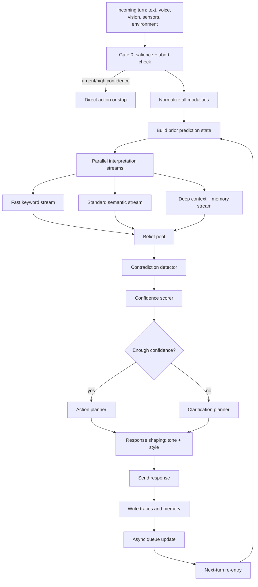

# now design complete flow with details sequcially what ever data moves back and forth that also mean I want flow chart, deatils , excat logical part what will happed and next and previous step will be created what will be all the fall backs of everything, how errors are going to be handled.

Below is the **complete revised flow** for Yuki, built as a predictive, multi-stream belief system with explicit fallbacks, error handling, and feedback loops. It is not a linear pipeline; it is a cycle where prediction shapes perception, perception updates belief, and belief updates future prediction. That structure matches predictive-processing accounts in neuroscience better than a one-pass recognizer.[^1][^2][^3][^4]

## Architecture goal

The system should never ask only “what did the user say?” It should ask “what was expected, what changed, and what should we do now?” That means each turn produces hypotheses, confidence, contradiction flags, and a final action only if confidence crosses a threshold.[^3][^5][^1]

## Flow chart

## Sequential logic

### 1. Gate 0: Salience check

Before any deep processing, the system checks if the input is an urgent abort, direct command, or obviously high-confidence request. Very short safety-critical inputs should bypass deeper parsing and go straight to action or stop handling. This is where attention/salience lives.[^6][^5][^1]

### 2. Normalize input

Each modality is cleaned separately: text is normalized, speech is corrected, vision/OCR is trimmed, and environment tags are standardized. Missing modalities are not failures; they become null inputs with low weight. That prevents the system from collapsing when only one channel is available.[^7][^8][^9]

### 3. Build prediction priors

Before interpreting the current turn, Yuki loads a `PredictionState` from recent conversation, current task, user habits, unresolved entities, and recent contradictions. This is the predictive layer: it sets expectations before evidence arrives.[^2][^4][^1][^3]

### 4. Run parallel streams

Three streams run at the same time:

- Fast stream: keyword and rule-based cues.
- Standard stream: semantic parsing, tone, entities, and intent.
- Deep stream: memory, contradiction history, environment, and async results.
Each stream emits hypotheses, not final truths.[^10][^5][^9][^7]

### 5. Build belief pool

All hypotheses are merged into a `BeliefPool`. Each hypothesis carries:

- candidate intent,
- target entity,
- tone,
- support score,
- conflict score,
- source module,
- confidence.
This is where competing interpretations coexist instead of being thrown away too early.[^5][^7][^10]

### 6. Detect contradictions

The contradiction stage checks whether current beliefs disagree with stored memory, recent turns, or another stream. Contradictions should be stored explicitly rather than overwritten, because the conflict itself is useful signal.[^4][^9][^1]

### 7. Score confidence

Confidence should be computed from:

- agreement across streams,
- strength of memory prior,
- quality of evidence,
- tone consistency,
- contradiction penalty,
- modality availability.
Repeated matches raise confidence; conflicting evidence lowers it.[^8][^1][^7][^4]

### 8. Resolve or clarify

If confidence is above threshold, the system acts. If it is below threshold, it asks one focused clarification question. The threshold must be hard, not vague, or the assistant will either over-ask or over-guess.[^9][^1][^5]

### 9. Shape the response

Tone should alter style, not truth. Frustration can make the response shorter and more direct; urgency can suppress extra explanation; curiosity can expand detail. Tone is a modifier on delivery and interpretation, not an isolated label.[^6][^4]

### 10. Write memory and traces

The system stores:

- raw input,
- normalized input,
- prediction priors,
- stream outputs,
- final belief,
- contradiction state,
- final action,
- errors if any.
Only distilled knowledge should become long-term semantic memory by default; raw traces should age out.[^7][^8][^9]

### 11. Async re-entry

Background learning, web fetches, and delayed contradiction resolution go into an async queue. On the next turn, the queue is checked first so learned facts can influence the new prediction state.[^5][^9]

## Fallback ladder

### Input fallback

If one modality fails, continue with the others. If all are weak, mark the turn low-confidence and ask for clarification.[^8][^9][^7]

### Parsing fallback

If grammar or entity extraction fails, keep the raw span and mark it ambiguous instead of forcing a label. Ambiguity should survive downstream so it can be resolved later.[^1][^4]

### Memory fallback

If memory disagrees with current input, do not erase either side immediately. Prefer recent user-confirmed memory, but keep the conflict until it is resolved by stronger evidence.[^2][^9][^1]

### Action fallback

If the resolver cannot safely choose, ask one specific clarification question. Never stack multiple questions unless the user explicitly asks for a complex plan.[^9][^5]

### Async fallback

If background results are too stale or irrelevant, drop them from the queue rather than injecting them into the current turn. That prevents old knowledge from hijacking a fresh conversation.[^5][^9]

## Error handling

Errors should be treated as first-class states:

- missing modality,
- OCR noise,
- transcript noise,
- unknown word,
- ambiguous entity,
- conflicting memory,
- low-confidence intent,
- failed tool/web lookup,
- stale async result,
- timeout.
For each error, preserve the evidence, reduce confidence, and select the appropriate fallback rather than crashing or guessing.[^4][^1][^7][^8]

## What goes backward

This is critical: the system must send information backward, not just forward.

- Memory feeds back into entity resolution.
- Resolved intent feeds back into tone interpretation.
- Action outcome feeds back into the next prediction state.
- Contradictions feed back into future priors.
That feedback loop is what makes the system feel adaptive instead of mechanical.[^3][^1][^2][^4]

## What the design means

This design means Yuki should behave like a listener with expectations, not a parser with a dictionary. It should maintain multiple hypotheses, weigh them against prediction error, and only commit when the evidence is strong enough. That is the practical interpretation of a brain-like architecture.[^11][^1][^3][^4]

## Final rule

The final rule is simple: **never collapse uncertainty too early**. Keep hypotheses alive, keep errors visible, keep memory active, and only act when the resolver is confident enough. That rule is what makes the whole architecture coherent.[^1][^9][^5]
[^12][^13][^14][^15][^16]

⁂

[^1]: https://pmc.ncbi.nlm.nih.gov/articles/PMC3518876/

[^2]: https://en.wikipedia.org/wiki/Predictive_coding

[^3]: https://onlinelibrary.wiley.com/doi/full/10.1111/tops.12704

[^4]: https://discovery.ucl.ac.uk/id/eprint/10067144/9/Friston_PC_music_FINAL.pdf

[^5]: https://www.nature.com/articles/s41598-025-25693-y

[^6]: https://mindsonline.philosophyofbrains.com/2015/session4/three-problems-for-the-predictive-coding-theory-of-attention/

[^7]: https://www.sciencedirect.com/science/article/pii/S0950705125004642

[^8]: https://iosrjournals.org/iosr-jce/papers/Vol27-issue4/Ser-1/H2704017280.pdf

[^9]: https://pmc.ncbi.nlm.nih.gov/articles/PMC12864826/

[^10]: https://arxiv.org/html/2605.16889v1

[^11]: https://pubmed.ncbi.nlm.nih.gov/22147913/

[^12]: https://www.sciencedirect.com/science/article/pii/S1878929325000143

[^13]: https://www.youtube.com/watch?v=p74ZKIzrD9U

[^14]: https://www.simonsfoundation.org/2021/06/03/the-challenges-of-proving-predictive-coding/

[^15]: https://www.youtube.com/watch?v=lPvtAdRKd7w

[^16]: https://open-mind.net/epubs/all-the-self-we-need/OEBPS/pt06.html

