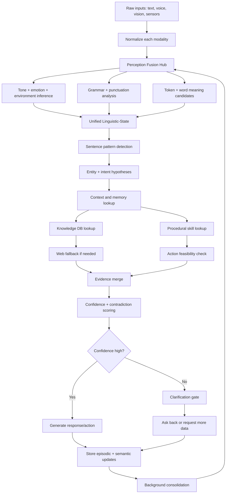

# now design complete flow with details sequcially what ever data moves back and forth that also mean I want flow chart, deatils , excat logical part what will happed and next and previous step will be created what will be all the fall backs of everything, how errors are going to be handled.

Below is the full design direction: a **layered, recursive, multimodal, error-aware brain loop** for Yuki that shows what happens before response, what gets stored, what gets retried, and what falls back when something is unclear. This is the correct level for your request because it covers not just sentence meaning, but perception, tone, memory, prediction, ambiguity, and failure handling end to end.[^1][^2][^3][^4]

## Core flow

The whole system should run like this:

1. **Capture all inputs**.
2. **Normalize each input separately**.
3. **Fuse all inputs into one perception state**.
4. **Interpret tone, grammar, and meaning**.
5. **Generate multiple hypotheses**.
6. **Score confidence and contradictions**.
7. **Retrieve memory and knowledge**.
8. **Run clarification or web fallback if needed**.
9. **Form the final answer or action**.
10. **Store outcomes for future learning**.[^5][^6][^3][^7]

This should not be a single straight line; it should be a loop with feedback from later stages back to earlier hypotheses when new evidence appears.[^8][^9][^1]

## Data movement

The data should move through these objects:

- **RawInput**: text, voice, vision, sensor state.
- **NormalizedInput**: cleaned text, corrected token candidates, timestamps.
- **PerceptionState**: fused signals from all modalities.
- **LinguisticState**: tokens, POS, grammar, punctuation, sentence type.
- **SemanticState**: entities, concepts, ambiguities, intent candidates.
- **MemoryState**: episodic, semantic, procedural, user profile.
- **EvidenceState**: DB hits, web hits, source trust, contradictions.
- **BeliefState**: competing interpretations with confidence.
- **ActionState**: answer, clarify, search, remember, execute.
- **LearningState**: what to store, update, or discard.[^10][^2][^3][^11]

## Complete flowchart

This is the main skeleton; every inner box should have its own logic and fallback chain.[^9][^5][^8][^1]

## Step-by-step logic

### 1. Raw capture

Everything enters together: text, voice transcript, camera context, sensor state, environment metadata, and recent conversation. If one modality is missing, the others still continue.[^3][^12][^13]

### 2. Separate normalization

Each channel gets cleaned independently.

- Text gets typo cleanup and punctuation repair.
- Voice gets STT cleanup and confidence.
- Vision gets OCR/object metadata if available.
- Environment gets standardized labels like `quiet`, `noisy`, `indoors`, `moving`, `low_light`.[^2][^10][^3]

### 3. Fusion hub

Then the system merges all signals into one **PerceptionState**.

- Align by timestamp,
- weigh by reliability,
- note missing modalities,
- keep conflicts, not just winners.[^4][^7][^3]

This is where “what I see,” “what I hear,” “what text I got,” “what environment I am in,” and “what tone is present” become one joint input to reasoning.[^12][^13][^3]

### 4. Tone and emotion

Tone should be inferred before intent finalization.

- calm,
- excited,
- rude,
- curious,
- sarcastic,
- confused,
- urgent,
- affectionate.[^14][^3][^4]

Tone can change the meaning of the same words, so it must modify confidence and response style.[^7][^3]

### 5. Grammar and punctuation

Sentence type is detected next:

- statement,
- question,
- command,
- exclamation,
- fragment,
- mixed form.

Then punctuation is interpreted:

- `?` strongly raises question intent,
- `!` raises emotional/exclamatory intent,
- missing punctuation lowers certainty, not meaning.[^15][^16][^17][^18]

### 6. Word-by-word meaning

Each token is checked against:

- local dictionary,
- morphology,
- grammar role,
- semantic entity candidates,
- user memory,
- web evidence if necessary.[^19][^20][^21]

Important: this is not done in isolation. Every word contributes to the whole sentence hypothesis, and the whole sentence also revises individual word meanings.[^20][^22][^19]

### 7. Hypothesis generation

For one sentence, keep multiple possible interpretations at once.
Example: `whoo are you`

- hypothesis A: typo of `who are you`
- hypothesis B: excited exclamation + query
- hypothesis C: unknown word + question-like structure

Each hypothesis gets a score from grammar, context, memory, and punctuation.[^18][^22][^19]

### 8. Memory and knowledge lookup

The system then queries:

- **working memory** for current context,
- **episodic memory** for recent turns,
- **semantic memory** for facts,
- **procedural memory** for action patterns,
- **knowledge DB** for public facts,
- **web** only if unresolved or under research policy.[^23][^24][^25][^26]

### 9. Contradiction handling

Contradictions are normal, so keep them explicit.

- If memory says one thing and DB says another, do not immediately overwrite.
- mark as `conflict_pending`,
- attach sources,
- choose by trust and recency,
- or ask the user.[^27][^28][^29][^30]

### 10. Confidence generation

Confidence should be computed from:

- exactness of match,
- number of agreeing signals,
- source trust,
- recency,
- consistency with context,
- contradiction penalties,
- modality agreement.[^28][^1][^27]

## Fallback ladder

Every stage needs a fallback.

### If normalization fails

- keep original text,
- mark uncertain tokens,
- continue.

### If word meaning fails

- search local variants,
- search memory,
- search DB,
- search web,
- if still uncertain, mark ambiguous.

### If grammar fails

- classify as fragment,
- use sentence pattern heuristics,
- lower confidence.

### If intent fails

- use conversational fallbacks:
    - greeting,
    - acknowledgment,
    - clarification,
    - meta-question.

### If entity fails

- keep multiple candidates,
- query context,
- ask back if necessary.

### If DB fails

- web fallback,
- then knowledge consolidation later.

### If web fails

- return uncertainty,
- ask clarification,
- do not invent.

### If response generation fails

- use safe fallback:
    - “I’m not fully sure what you mean.”
    - “Do you mean X or Y?”
    - “Can you rephrase?”[^6][^8][^9]

## Sync vs async

### Synchronous

Must happen before response:

- normalization,
- fusion,
- grammar,
- intent,
- context lookup,
- confidence scoring,
- clarification decision.

### Asynchronous

Can happen in background:

- web search,
- smart scrapping,
- deeper evidence expansion,
- contradiction resolution,
- long-term memory consolidation,
- relation graph updates.[^5][^1][^2][^9]

That means Yuki can respond fast while still learning deeply afterward.[^8][^1]

## How errors should work

Every error should become a state, not a crash.

### Types of errors

- missing modality,
- noisy input,
- unknown word,
- typo,
- grammar mismatch,
- intent ambiguity,
- entity ambiguity,
- DB miss,
- web miss,
- contradictory facts,
- low confidence,
- tool failure,
- timeout.

### Error handling rules

- preserve all raw evidence,
- do not delete uncertain interpretations,
- keep error source,
- lower confidence,
- trigger fallback,
- if still unresolved, ask the user.[^31][^6][^8]

## Where storage should happen

You need separate stores:

- **Short-term context store** for current turn and active hypotheses.
- **Episodic store** for conversation events and sensory snapshots.
- **Semantic store** for facts and concepts.
- **Entity store** for canonical meaning and variants.
- **Grammar store** for sentence rules and exceptions.
- **Tone store** for emotional/pragmatic patterns.
- **Belief store** for hypotheses and confidence.
- **Error store** for failed cases and fallback paths.
- **Consolidation queue** for background learning.

This way, Yuki remembers not just what happened, but how it was interpreted and why.[^29][^30][^27][^28]

## Best practical rule

The system should always follow this order:

**collect everything → normalize everything → fuse everything → hypothesize everything → score everything → resolve or ask back → store everything important → learn in background.**

That is the closest practical approximation of how a brain-like assistant should behave.[^13][^10][^3][^7]

## What still must be added later

Even this design still needs implementation details for:

- exact table schema,
- exact confidence formula,
- exact fallback thresholds,
- conflict resolution priority,
- and how user memory should override public memory without destroying it.

Those are the next design layer after this one.[^30][^27][^28][^29]

If you want, I can do the next step and turn this into a **full engineering blueprint** with:

1. database schema,
2. exact module order,
3. exact fallback rules,
4. exact confidence formula,
5. and a Mermaid architecture diagram for Yuki.
[^32][^33]

⁂

[^1]: https://docs.vellum.ai/product/workflows/common-architectures/fallback-models

[^2]: https://pmc.ncbi.nlm.nih.gov/articles/PMC11141806

[^3]: https://www.kyb.tuebingen.mpg.de/149529/multimodal-perception

[^4]: https://dl.acm.org/doi/10.1145/3747327.3764904

[^5]: https://machinelearning.apple.com/research/llm-fusion-low-rank

[^6]: https://towardsdatascience.com/handling-chatbot-failure-gracefully-466f0fb1dcc5/

[^7]: https://nmoer.pressbooks.pub/cognitivepsychology/chapter/multimodal-perception/

[^8]: https://www.rysun.com/glossaryterms/fallback-handling/

[^9]: https://learn.microsoft.com/en-us/azure/data-factory/tutorial-pipeline-failure-error-handling

[^10]: https://www.sciencedirect.com/science/article/pii/S2590005625001924

[^11]: https://www.sciencedirect.com/topics/computer-science/multimodal-information

[^12]: https://www.the-innovation.org/article/id/67e50c2fd0f9b9229dbb2d80

[^13]: https://www.tiledb.com/blog/multimodal-ai-guide

[^14]: https://www.linkedin.com/posts/andreaswsjostrom_yesterday-we-explored-how-ai-might-respond-activity-7318619280189599745-rCcg

[^15]: https://www.english-grammar-revolution.com/sentence-types.html

[^16]: https://www.bbc.co.uk/bitesize/articles/zvp6dp3

[^17]: https://www.englishclub.com/grammar/sentence/type.php

[^18]: https://sitams.ac.in/wp-content/uploads/2026/02/NLP-UNIT-1-notes.pdf

[^19]: https://www.turing.com/kb/natural-language-processing-function-in-ai

[^20]: https://apxml.com/courses/nlp-fundamentals/chapter-1-nlp-text-processing-techniques/nlp-pipeline-overview

[^21]: https://www.scaler.com/topics/nlp/introduction-to-grammar-in-nlp/

[^22]: https://labelyourdata.com/articles/machine-learning/intent-classification

[^23]: https://qbi.uq.edu.au/memory/types-memory

[^24]: https://pubmed.ncbi.nlm.nih.gov/19847359/

[^25]: https://pmc.ncbi.nlm.nih.gov/articles/PMC8611531/

[^26]: https://qbi.uq.edu.au/memory/where-are-memories-stored

[^27]: https://arxiv.org/html/2405.16929v2

[^28]: https://www.nature.com/articles/s41598-026-38066-w

[^29]: https://kclpure.kcl.ac.uk/portal/files/181423293/KG_in_NLP_survey_AACL.pdf

[^30]: https://cse.iitk.ac.in/users/cs365/2015/_submissions/smanocha/report.pdf

[^31]: https://namastedev.com/blog/advanced-patterns-for-error-handling-in-large-web-apps/

[^32]: https://www.youtube.com/shorts/6Nrbd0gFPKA

[^33]: http://www.jatit.org/volumes/Vol104No4/18Vol104No4.pdf

