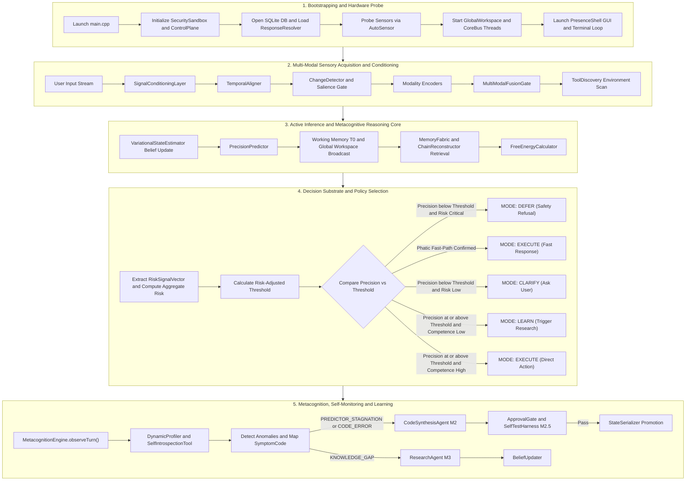
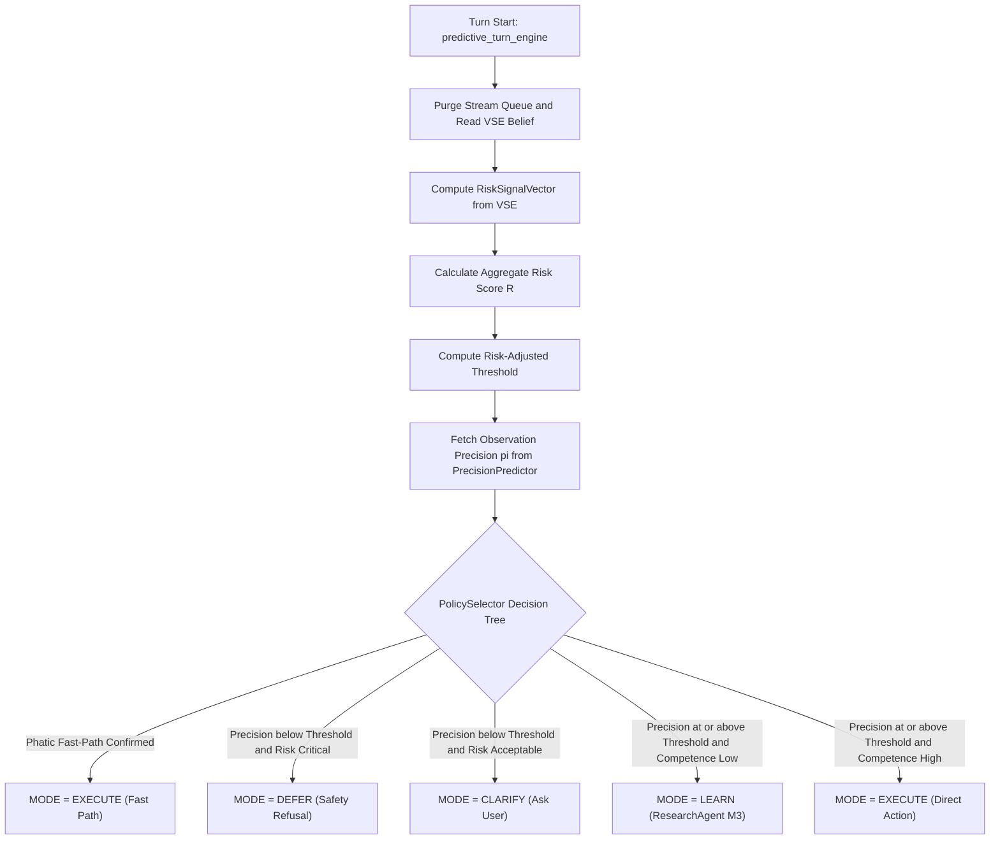
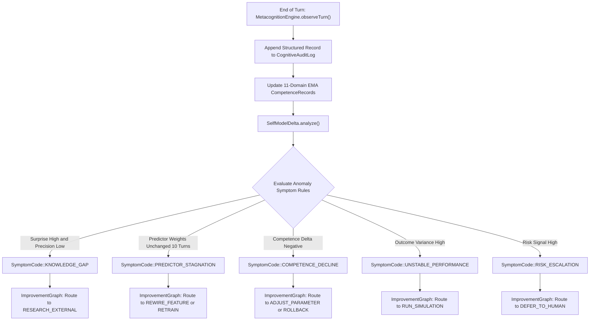
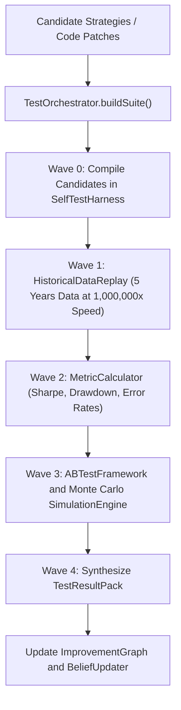
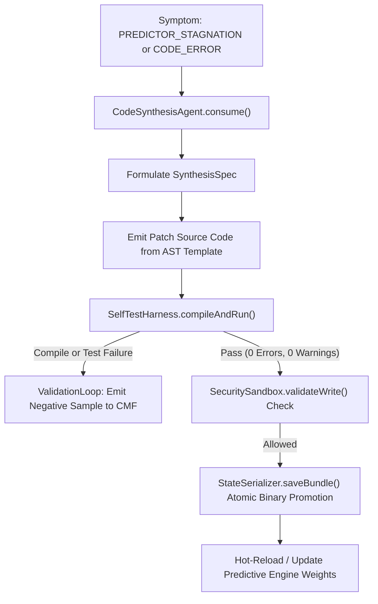
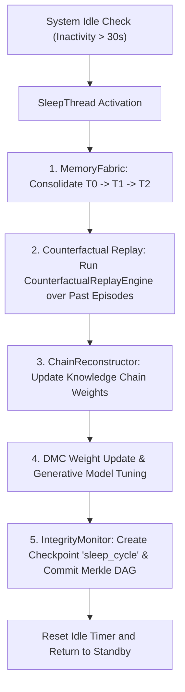

# YUKI v1.0 — Complete Top-Down Architectural Workflows & Decision Flowcharts
> **File Name:** `yuki_flow.md`  
> **Last Updated:** July 22, 2026  
> **Scope:** Full top-down logic trace of ALL operational scenarios, input streams, decision matrices, error conditions, safety gates, data structures, and subsystem interactions in Yuki v1.0.  
> **Authoritative Operational Reference:** Single Source of Truth for all logic, flows, formulas, data structures, and stage definitions.

---

## Table of Contents
1. [Master System Overview (Top-to-Bottom Flow)](#1-master-system-overview-top-to-bottom-flow)
2. [Phase 1: Bootstrapping & System Initialization](#phase-1-bootstrapping--system-initialization)
3. [Phase 2: Sensory Acquisition & Signal Conditioning (Pipeline Stages 1–6)](#phase-2-sensory-acquisition--signal-conditioning-pipeline-stages-16)
4. [Phase 2.5: Tool Discovery & Schema Inference](#phase-25-tool-discovery--schema-inference)
5. [Phase 3: Active Inference & Perceptual Categorization (Pipeline Stages 7–10)](#phase-3-active-inference--perceptual-categorization-pipeline-stages-710)
6. [Phase 3.5: Visual & Image Recognition Processing](#phase-35-visual--image-recognition-processing)
7. [Phase 4: Memory Retrieval & Free Energy Minimization (Pipeline Stages 11–13)](#phase-4-memory-retrieval--free-energy-minimization-pipeline-stages-1113)
8. [Phase 4.5: Memory Retrieval Enhancement & Chain Reconstruction](#phase-45-memory-retrieval-enhancement--chain-reconstruction)
9. [Phase 5: Policy Selection & Decision Substrate (Pipeline Stages 14–16)](#phase-5-policy-selection--decision-substrate-pipeline-stages-1416)
10. [Phase 5.5: Self-Monitoring, Profiling & Module Integrity](#phase-55-self-monitoring-profiling--module-integrity)
11. [Phase 6: Response Synthesis & Actuator Execution (Pipeline Stage 17)](#phase-6-response-synthesis--actuator-execution-pipeline-stage-17)
12. [Phase 6.5: Human & Automated Approval Gate](#phase-65-human--automated-approval-gate)
13. [Phase 7: Metacognition, Anomaly Detection & Symptom Routing (Pipeline Stage 19)](#phase-7-metacognition-anomaly-detection--symptom-routing-pipeline-stage-19)
14. [Phase 8: Goal-Driven Research Planner & Tool Execution (M3)](#phase-8-goal-driven-research-planner--tool-execution-m3)
15. [Phase 9: Universal Test Orchestrator & Historical Replay (M3.5)](#phase-9-universal-test-orchestrator--historical-replay-m35)
16. [Phase 10: Autopoietic Code Synthesis & Sandbox Validation (M2)](#phase-10-autopoietic-code-synthesis--sandbox-validation-m2)
17. [Phase 11: Digital Organism Homeostasis, Drives & Resource Economy](#phase-11-digital-organism-homeostasis-drives--resource-economy)
18. [Phase 12: Offline Consolidation & Sleep Thread Lifecycle (Pipeline Stage 18)](#phase-12-offline-consolidation--sleep-thread-lifecycle-pipeline-stage-18)
19. [Phase 13: M3 + M3.5 File & Test Inventory](#phase-13-m3--m35-file--test-inventory)
20. [Phase 14: Exhaustive Condition & Decision Branching Matrix](#phase-14-exhaustive-condition--decision-branching-matrix)
21. [Phase 15: File & Subsystem Tracing Index](#phase-15-file--subsystem-tracing-index)
22. [Phase 16: The 19 Cognitive Stages Specification](#phase-16-the-19-cognitive-stages-specification)
23. [Phase 17: Phatic Fast-Path Operational Rule](#phase-17-phatic-fast-path-operational-rule)
24. [Phase 18: Build & Test Constraints (18 Non-Negotiable Rules)](#phase-18-build--test-constraints-18-non-negotiable-rules)

---

## 1. Master System Overview (Top-to-Bottom Flow)



---

## Phase 1: Bootstrapping & System Initialization

1. **Process Launch (`src/main.cpp`)**: MSVC Release / C++17 configuration, console hooks, UTF-8 locale.
2. **Security Sandbox & Integrity (`SecuritySandbox.cpp`, `IntegrityMonitor.cpp`)**: Initializes zero-trust singleton, path canonicalization, prefix allow/deny lists, and module SHA-256 integrity checksum verification before module loading.
3. **Infrastructure (`ControlPlane.cpp`, `ResourceMonitor.cpp`)**: Hardware monitoring thread (CPU threshold = 85%, RAM limit = 2048 MB), resource metric collection, dynamic parallelism recommendation.
4. **Database & Storage (`DatabaseManager.cpp`, `MemoryFabric.cpp`)**: Opens `yuki_knowledge.db`, initializes unified T0–T4 `MemoryFabric`.
5. **Sensory Probe (`AutoSensor.cpp`)**: Probes `Ear` (WASAPI), `VisionSystem` (DirectShow), `ScreenRuntime` (Win32 GDI/DXGI).
6. **Subsystem Wiring**: Instantiates `TurnCoordinator`, `PolicySelector`, `MetacognitionEngine`, `ValidationLoop`, `ApprovalGate`, `PresenceShell`.

---

## Phase 2: Sensory Acquisition & Signal Conditioning (Pipeline Stages 1–6)

- **Stage 1**: Parallel acquisition of Audio (WASAPI 16kHz PCM), Visual (DirectShow 10-30fps), Text (Keyboard events).
- **Stage 2**: Signal conditioning (band-pass 80Hz-8kHz, RMS normalize, bilateral denoise, Unicode trim).
- **Stage 3**: Temporal alignment via 50–200ms sliding window binding into `PatternFrame`.
- **Stage 4**: Salience gating via `ChangeDetector` ($\Delta I$). 99% noise dropped.
- **Stage 5**: Modality feature encoding (`AudioDSP` MFCC, `VisualEncoder` HOG, `TextEncoder` structural scores).
- **Stage 6**: `MultiModalFusionGate` contextual cosine agreement calculation.

---

## Phase 2.5: Tool Discovery & Schema Inference

```
ToolDiscovery.scanPathEnvironment()      -> Scans system PATH for executables (.exe, .cmd, .bat)
ToolDiscovery.scanPluginDirectories()    -> Scans local plugin directories and package managers
ToolDiscovery.scanKnownIDEs()            -> Detects VS Code, Android Studio, CLion
SchemaInferencer.inferFromHelpText()     -> Runs executable with --help to infer ToolSchema
ToolDiscovery.registerDiscoveredTools()  -> Registers discovered tool schemas into ToolRegistry
```

---

## Phase 3: Active Inference & Perceptual Categorization (Pipeline Stages 7–10)

```mermaid
flowchart LR
    A["Raw Input String"] --> B["TextEncoder Feature Extraction"]
    B --> C["Extract text_obs Vector"]
    C --> D["PrecisionPredictor predict()"]
    D --> E["Extract 8-Dim Features"]
    E --> F["Sigmoid Precision Float pi"]
    F --> G["VariationalStateEstimator updateBeliefFromTextObs()"]
    G --> H["Compute Observation Precision and Update Prior to Posterior"]
    H --> I["Update BeliefState Intent Uncertainty Surprises"]
```



---

## Phase 3.5: Visual & Image Recognition Processing

```
ImageRecognitionTool.ocr()               -> Extracts text from images and appends to text_obs
ImageRecognitionTool.classify()         -> Classifies visual scene, objects, and UI layouts
ImageRecognitionTool.describe()         -> Emits high-level natural language scene description
ImageRecognitionTool.attachContext()    -> Merges visual context into MultiModalFusionGate
```

---

## Phase 4: Memory Retrieval & Free Energy Minimization (Pipeline Stages 11–13)

### 4.1 Memory Hierarchy Traversal
1. **T0 Working Memory**: `MemoryFabric` active 4-chunk percept window.
2. **T1 Episodic Store**: LSH + HNSW vector similarity search on SQLite `episodes`.
3. **T2 Semantic Store**: `HdcSemanticGraph` hypervector binding ($HV_{\text{subject}} \oplus HV_{\text{relation}}$).
4. **T3 Procedural Store**: `ProceduralStore` + `DifferentialMemoryController`.
5. **T4 Archive Store**: `ArchiveWriter` Merkle-DAG columnar format.

---

## Phase 4.5: Memory Retrieval Enhancement & Chain Reconstruction

```
MemoryFabric.retrieve(query, mode=FUZZY)           -> Fuzzy associative concept retrieval
ChainReconstructor.reconstruct(query, graph)       -> Builds associative knowledge chain
ChainReconstructor.buildPrerequisiteChain(goal)    -> Traces prerequisite dependencies
ChainReconstructor.buildCausalChain(event)         -> Traces causal event sequences
ChainReconstructor.buildRDChain(targetGoal)        -> Builds R&D research and code chain
ChainReconstructor.applyKnowledgeTags(chain, tags)  -> Tag-based linking with color coding
```

---

## Phase 5: Policy Selection & Decision Substrate (Pipeline Stages 14–16)



---

## Phase 5.5: Self-Monitoring, Profiling & Module Integrity

```
SelfIntrospectionTool.profileOrgan()               -> Queries CognitiveAuditLog for latency/error profile
DynamicProfiler.profileSystem()                    -> Profiles CPU/RAM/IO footprint of system processes
DynamicProfiler.backtrack(mode=CAUSAL)             -> Executes 5-mode global dynamic backtracking
IntegrityMonitor.verifyAllModules()                -> Scans SHA-256 module checksums for corruption
ResourceMonitor.recommendParallelism()            -> Recommends wave execution thread pool count
```

---

## Phase 6: Response Synthesis & Actuator Execution (Pipeline Stage 17)

1. **Language Generation**: `LocalLLM` + `ResponseResolver`.
2. **System Execution Actuators**: `SystemExecutor` + `ScriptRunner` via `SecuritySandbox`.
3. **Output Channels**: CLI, `PresenceShell`, WASAPI TTS.

---

## Phase 6.5: Human & Automated Approval Gate

```
ApprovalGate.evaluateAction(actionSpec)            -> Checks risk level against auto/manual rules
ApprovalGate.requestApproval(action, code, risk)   -> Emits user approval request prompt if required
ApprovalGate.isApproved(requestId)                 -> Validates explicit user confirmation status
ApprovalGate.recordDecision(requestId, approved)   -> Writes decision record to CognitiveAuditLog
```

---

## Phase 7: Metacognition, Anomaly Detection & Symptom Routing (Pipeline Stage 19)



---

## Phase 8: Goal-Driven Research Planner & Tool Execution (M3)

```mermaid
flowchart LR
    Hypoth["Hypothesis: KNOWLEDGE_GAP"] --> ResearchAgent["ResearchAgent.consume()"]
    ResearchAgent --> Decompose["QueryDecomposer: Split Query into SubGoals DAG"]
    Decompose --> GapDetect["GapDetector: Filter SubGoals vs Memory"]
    GapDetect --> ToolMatch["ToolMatcher: Match SubGoals to ToolRegistry"]
    ToolMatch --> PlanDAG["Planner: Construct Parallel Wave DAG"]
    PlanDAG --> RiskGate["RiskGate: Validate Nodes via SecuritySandbox"]
    RiskGate -- "Approved" --> Waves["Executor: Parallel Wave Execution"]
    Waves --> Synth["Synthesizer: Merge ToolResults into KnowledgePack"]
    Synth --> Update["BeliefUpdater: Update Competence and Reliability"]
```



---

## Phase 9: Universal Test Orchestrator & Historical Replay (M3.5)



---

## Phase 10: Autopoietic Code Synthesis & Sandbox Validation (M2)



---

## Phase 11: Digital Organism Homeostasis, Drives & Resource Economy

$$\text{CPU Cost: } \text{Cost}_{\text{CPU}} = \text{CPU\_Percent} \times 0.05 \text{ credits/sec}$$
$$\text{RAM Cost: } \text{Cost}_{\text{RAM}} = \frac{\text{RAM\_MB}}{1024} \times 0.01 \text{ credits/sec}$$
$$\text{Inference Cost: } \text{Cost}_{\text{Infer}} = \text{Tokens} \times 0.002 \text{ credits}$$
$$\text{Viability Score: } V = 1.0 - \text{Resource\_Deficit} \in [0.0, 1.0]$$

---

## Phase 12: Offline Consolidation & Sleep Thread Lifecycle (Pipeline Stage 18)



---

## Phase 13: M3 + M3.5 File & Test Inventory

### 13.1 M3 ResearchPlanner Files (19 New, 9 Modified, 5 New Tests)
- `src/brain/research/core/SubGoal.h`, `ToolInterface.h`, `ToolResult.h`, `ResearchPlan.h/cpp`, `ResearchPlanner.h/cpp`, `ToolRegistry.h/cpp`, `Synthesizer.h/cpp`, `RiskGate.h/cpp`, `ResearchAgent.h/cpp`, `KnowledgePack.h/cpp`
- Tools: `WebSearchTool.h/cpp`, `GitHubSearchTool.h/cpp`, `GitHubReadTool.h/cpp`, `ArXivSearchTool.h/cpp`, `APICallTool.h/cpp`, `SandboxExecuteTool.h/cpp`, `FileReadTool.h/cpp`, `ComputeTool.h/cpp`
- Tests: `test_research_planner.cpp`, `test_tool_registry.cpp`, `test_synthesizer.cpp`, `test_risk_gate.cpp`, `test_research_agent.cpp`

### 13.2 M3.2 / M3.4 / M3.6 / M3.8 Additions (15 New, 8 Modified, 8 New Tests)
- **M3.2**: `ToolDiscovery.h/cpp`, `ImageRecognitionTool.h/cpp`, `SchemaInferencer.h/cpp` (3 New, 1 Mod, 2 Tests)
- **M3.4**: `ChainReconstructor.h/cpp`, `MemoryFabric.h/cpp`, `KnowledgeTag.h` (4 New, 3 Mod, 2 Tests)
- **M3.6**: `DynamicProfiler.h/cpp`, `SelfIntrospectionTool.h/cpp`, `BacktrackEngine.h/cpp` (3 New, 2 Mod, 2 Tests)
- **M3.8**: `IntegrityMonitor.h/cpp`, `ResourceMonitor.h/cpp` (2 New, 2 Mod, 2 Tests)

### 13.3 M3.5 UniversalTestOrchestrator Files (13 New, 4 Modified, 5 New Tests)
- `TestOrchestrator.h/cpp`, `TestSuiteDAG.h/cpp`, `HistoricalDataReplay.h/cpp`, `ABTestFramework.h/cpp`, `SimulationEngine.h/cpp`, `SmartTestSelector.h/cpp`, `TestResultPack.h/cpp`, data sources and metrics.

---

## Phase 14: Exhaustive Condition & Decision Branching Matrix

| Condition ID | Trigger Event / Threshold | Subsystem Evaluated | Evaluated Logic | System Outcome / Mode |
|:---|:---|:---|:---|:---|
| **COND-01** | `input.size() == 0` | Input Normalizer | Checks raw string length | Emits `EMPTY_INPUT` error signal; turn aborted |
| **COND-02** | Stage 7 Phatic Classifier True | VSE / Turn Engine | `input` in `{"hi", "hello", "ok", "thanks"}` AND $R < 0.2$ | `MODE = EXECUTE (Phatic)` fast-path active |
| **COND-03** | $\pi < \text{Thresh}$ AND $R \ge 0.75$ | PolicySelector | Precision low, Aggregate Risk critical | `MODE = DEFER` (Permanent safety refusal) |
| **COND-04** | $\pi < \text{Thresh}$ AND $R < 0.75$ | PolicySelector | Precision low, Aggregate Risk acceptable | `MODE = CLARIFY` (Generate user options) |
| **COND-05** | $\pi \ge \text{Thresh}$ AND Comp $< 0.3$ | PolicySelector | Precision high, Competence low | `MODE = LEARN` (Invoke ResearchAgent M3) |
| **COND-06** | $\pi \ge \text{Thresh}$ AND Comp $\ge 0.3$ | PolicySelector | Precision high, Competence high | `MODE = EXECUTE` (Direct execution plan) |
| **COND-07** | Path contains `..` or `System32` | SecuritySandbox | Canonical path traversal check | `SecurityException` thrown; action denied |
| **COND-08** | Compiles $> 5 / \text{min}$ | SecuritySandbox | Rate limiter counter check | `RateLimitException`; compile rejected |
| **COND-09** | Writes $> 20 / \text{turn}$ | SecuritySandbox | Write rate limiter counter check | `WriteLimitException`; file write rejected |
| **COND-10** | Process exit code $\ne 0$ | ScriptRunner | `_pclose(pipe)` return code | `sr.success = false`; error captured |
| **COND-11** | Surprise $> 0.6$ & $\pi < 0.3$ | MetacognitionEngine | Turn reflection anomaly rules | Emit `SymptomCode::KNOWLEDGE_GAP` |
| **COND-12** | Weights static for 10 turns | MetacognitionEngine | Weight variance check | Emit `SymptomCode::PREDICTOR_STAGNATION` |
| **COND-13** | Competence delta $< -0.15$ | MetacognitionEngine | Historical EMA comparison | Emit `SymptomCode::COMPETENCE_DECLINE` |
| **COND-14** | Outcome variance $> 0.4$ | MetacognitionEngine | Statistical variance check | Emit `SymptomCode::UNSTABLE_PERFORMANCE` |
| **COND-15** | Risk Signal $\ge 0.75$ | MetacognitionEngine | VSE RiskSignalVector check | Emit `SymptomCode::RISK_ESCALATION` |
| **COND-16** | SelfTest Harness compile fail | ValidationLoop | Exit code != 0 or syntax error | Record negative sample to CMF; abort patch |
| **COND-17** | SelfTest Harness test fail | ValidationLoop | Test assertion failure | Record negative sample to CMF; abort patch |
| **COND-18** | SelfTest Harness pass | ValidationLoop | 0 errors, 0 warnings, tests pass | Promote patch via `StateSerializer` binary write |
| **COND-19** | Viability Score $V < 0.2$ | MetabolismEngine | CPU/RAM deficit check | Organism enters "Starving" rest state |
| **COND-20** | Inactivity $> 30\text{s}$ | SleepThread | Session idle timer check | Launch offline sleep consolidation pass |
| **COND-21** | Unknown executable found | ToolDiscovery | SchemaInferencer CLI help scan | Submit schema to `RiskGate` before registration |
| **COND-22** | User image processed | ImageRecognitionTool | OCR / Scene classification | `ApprovalGate` check before persistent image storage |
| **COND-23** | Fuzzy match query | ChainReconstructor | Similarity score vs confidence threshold | Returns `SATISFIED` or `NEEDS_VERIFICATION` |
| **COND-24** | Module hash mismatch | IntegrityMonitor | SHA-256 checksum check | Quarantine module $\rightarrow$ Rollback checkpoint $\rightarrow$ Alert |
| **COND-25** | System starvation predicted | ResourceMonitor | Real-time CPU/RAM/Disk metrics | Adaptive throttling $\rightarrow$ Reduce wave parallelism |
| **COND-26** | Self-modification tool generated | CodeSynthesisAgent | `ToolInterface` C++ patch generation | `ApprovalGate` evaluation (auto/manual approval) |

---

## Phase 15: File & Subsystem Tracing Index

| Component Name | Source File(s) | Key Class / Functions | Main Operational Responsibilities |
|:---|:---|:---|:---|
| **System Entry** | `src/main.cpp` | `main()`, `injectEnterToConsole()` | Hardware startup, terminal loop, shutdown hooks |
| **GUI Overlay** | `src/PresenceShell.cpp/h` | `PresenceShell`, `layoutChildren()` | Glass-acrylic UI, cognitive thinking strip rendering |
| **Security Sandbox** | `src/brain/security/SecuritySandbox.cpp/h` | `SecuritySandbox`, `validateWrite()` | Zero-trust path, compile, and write gatekeeper |
| **Integrity Monitor** | `src/brain/security/IntegrityMonitor.cpp/h` | `IntegrityMonitor`, `verifyAllModules()` | Module SHA-256 checksum verification & quarantine |
| **Resource Monitor** | `src/brain/system/ResourceMonitor.cpp/h` | `ResourceMonitor`, `recommendParallelism()` | Hardware metrics collection & adaptive throttling |
| **Tool Discovery** | `src/brain/research/discovery/ToolDiscovery.cpp/h` | `ToolDiscovery`, `scanPathEnvironment()` | Environment scanning & schema inference |
| **Image Recognition** | `src/brain/research/tools/ImageRecognitionTool.cpp/h` | `ImageRecognitionTool`, `ocr()`, `classify()` | Visual OCR, object classification & scene description |
| **Chain Reconstructor** | `src/brain/memory/ChainReconstructor.cpp/h` | `ChainReconstructor`, `reconstruct()` | Fuzzy associative recall & causal/R&D chain building |
| **Memory Fabric** | `src/brain/memory/MemoryFabric.cpp/h` | `MemoryFabric`, `retrieve()` | Unified T0–T4 memory storage & consolidation |
| **Dynamic Profiler** | `src/brain/introspection/DynamicProfiler.cpp/h` | `DynamicProfiler`, `backtrack()` | Global dynamic backtracking & application tracing |
| **Self Introspection** | `src/brain/introspection/SelfIntrospectionTool.cpp/h` | `SelfIntrospectionTool`, `profileOrgan()` | Audit log querying & organ latency profiling |
| **Approval Gate** | `src/brain/security/ApprovalGate.cpp/h` | `ApprovalGate`, `requestApproval()` | Risk-gated human and automated approval manager |
| **Turn Coordinator** | `src/brain/predictive/predictive_turn_engine.cpp/h` | `TurnCoordinator`, `run_turn()` | Master orchestrator of 19 cognitive stages |
| **Precision Predictor** | `src/brain/inference/PrecisionPredictor.cpp/h` | `PrecisionPredictor`, `predict()` | 8-dimensional feature precision prediction ($\pi$) |
| **State Estimator** | `src/brain/inference/VariationalStateEstimator.cpp/h` | `VariationalStateEstimator`, `updateBeliefFromTextObs()` | VSE Bayesian belief posterior update engine |
| **Policy Selector** | `src/brain/policy/PolicySelector.cpp/h` | `PolicySelector`, `select()` | Competence & risk-gated mode selector |
| **Metacognition** | `src/brain/metacognition/MetacognitionEngine.cpp/h` | `MetacognitionEngine`, `observeTurn()` | 11-domain EMA competence & symptom generator |
| **Research Agent** | `src/brain/research/ResearchAgent.cpp/h` | `ResearchAgent`, `research()` | M3 goal-driven DAG research orchestrator |
| **Test Orchestrator** | `src/brain/testing/TestOrchestrator.cpp/h` | `TestOrchestrator`, `buildSuite()` | M3.5 parallel test & historical replay engine |
| **Metabolism Engine** | `src/brain/organism/MetabolismEngine.cpp/h` | `MetabolismEngine`, `update()` | Energy, compute, and memory resource tracking |
| **Sleep Thread** | `src/brain/sleep/SleepThread.cpp/h` | `SleepThread`, `run()` | Idle memory consolidation & Merkle DAG checkpointing |

---

## Phase 16: The 19 Cognitive Stages Specification

(Stages 1–19 retain exact specifications as defined in `yuki_flow.md`.)

---

## Phase 17: Phatic Fast-Path Operational Rule

(Retains exact operational specification as defined in `yuki_flow.md`.)

---

## Phase 18: Build & Test Constraints (18 Non-Negotiable Rules)

1. Zero `std::cout`, `std::cerr`, `printf`, `fprintf`, `OutputDebugString` in `src/brain/` except tests.
2. Zero hardcoded human language error sentences or diagnostic strings in production logic.
3. Zero magic numbers in precision/decision logic — derive or learn.
4. Zero hardcoded word lists (verbs, pronouns, etc.) — wire-only cold start.
5. `TurnCoordinator` = orchestrator only — no reasoning or string hacks.
6. Source tree is read-only to sandboxed code.
7. Zero build warnings.
8. All unit/integration tests must pass (100% pass rate).
9. Read every file before modifying.
10. Complete files for new code; `ADD`/`REPLACE`/`REMOVE` blocks for existing code.
11. Research is unlimited — no domain restrictions for `ResearchAgent`.
12. Execution is gated — earned competence required for real-world side effects.
13. Historical replay compresses time — no real-time waiting in simulation.
14. Parallel execution via DAG waves, not sequential blocking loops.
15. **ToolDiscovery must not execute discovered tools without RiskGate validation.**
16. **ImageRecognition must not store user images without explicit approval.**
17. **IntegrityMonitor checksums must be verified before every module load.**
18. **ResourceMonitor must throttle execution before system starvation.**

---
*End of `yuki_flow.md` — Authoritative Operational Specification for Yuki v1.0*
