# YUKI v1.0 — Complete Top-Down Architectural Workflows & Decision Flowcharts
> **File Name:** `yuki_flow.md`  
> **Last Updated:** July 22, 2026  
> **Scope:** Full top-down logic trace of ALL operational scenarios, input streams, decision matrices, error conditions, safety gates, data structures, and subsystem interactions in Yuki v1.0.  
> **Authoritative Operational Reference:** Single Source of Truth for all logic, flows, formulas, data structures, and stage definitions.

---

## Table of Contents
1. [Master System Overview (Top-to-Bottom Flow)](#1-master-system-overview-top-to-bottom-flow)
2. [Phase 1: Bootstrapping & System Initialization](#phase-1-bootstrapping--system-initialization)
3. [Phase 2: Sensory Acquisition & Signal Conditioning (Pipeline Stages 1–6)](#phase-2-sensory-acquisition--signal-conditioning-pipeline-stages-16)
4. [Phase 2.5: Tool Discovery & Schema Inference](#phase-25-tool-discovery--schema-inference)
5. [Phase 3: Active Inference & Perceptual Categorization (Pipeline Stages 7–10)](#phase-3-active-inference--perceptual-categorization-pipeline-stages-710)
6. [Phase 3.5: Visual & Image Recognition Processing](#phase-35-visual--image-recognition-processing)
7. [Phase 4: Memory Retrieval & Free Energy Minimization (Pipeline Stages 11–13)](#phase-4-memory-retrieval--free-energy-minimization-pipeline-stages-1113)
8. [Phase 4.5: Memory Retrieval Enhancement & Chain Reconstruction](#phase-45-memory-retrieval-enhancement--chain-reconstruction)
9. [Phase 5: Policy Selection & Decision Substrate (Pipeline Stages 14–16)](#phase-5-policy-selection--decision-substrate-pipeline-stages-1416)
10. [Phase 5.5: Self-Monitoring, Profiling & Module Integrity](#phase-55-self-monitoring-profiling--module-integrity)
11. [Phase 6: Response Synthesis & Actuator Execution (Pipeline Stage 17)](#phase-6-response-synthesis--actuator-execution-pipeline-stage-17)
12. [Phase 6.5: Human & Automated Approval Gate](#phase-65-human--automated-approval-gate)
13. [Phase 7: Metacognition, Anomaly Detection & Symptom Routing (Pipeline Stage 19)](#phase-7-metacognition-anomaly-detection--symptom-routing-pipeline-stage-19)
14. [Phase 8: Goal-Driven Research Planner & Tool Execution (M3)](#phase-8-goal-driven-research-planner--tool-execution-m3)
15. [Phase 9: Universal Test Orchestrator & Historical Replay (M3.5)](#phase-9-universal-test-orchestrator--historical-replay-m35)
16. [Phase 10: Autopoietic Code Synthesis & Sandbox Validation (M2)](#phase-10-autopoietic-code-synthesis--sandbox-validation-m2)
17. [Phase 11: Digital Organism Homeostasis, Drives & Resource Economy](#phase-11-digital-organism-homeostasis-drives--resource-economy)
18. [Phase 12: Offline Consolidation & Sleep Thread Lifecycle (Pipeline Stage 18)](#phase-12-offline-consolidation--sleep-thread-lifecycle-pipeline-stage-18)
19. [Phase 13: M3 + M3.5 File & Test Inventory](#phase-13-m3--m35-file--test-inventory)
20. [Phase 14: Exhaustive Condition & Decision Branching Matrix](#phase-14-exhaustive-condition--decision-branching-matrix)
21. [Phase 15: File & Subsystem Tracing Index](#phase-15-file--subsystem-tracing-index)
22. [Phase 16: The 19 Cognitive Stages Specification](#phase-16-the-19-cognitive-stages-specification)
23. [Phase 17: Phatic Fast-Path Operational Rule](#phase-17-phatic-fast-path-operational-rule)
24. [Phase 18: Build & Test Constraints (18 Non-Negotiable Rules)](#phase-18-build--test-constraints-18-non-negotiable-rules)

---

## 1. Master System Overview (Top-to-Bottom Flow)

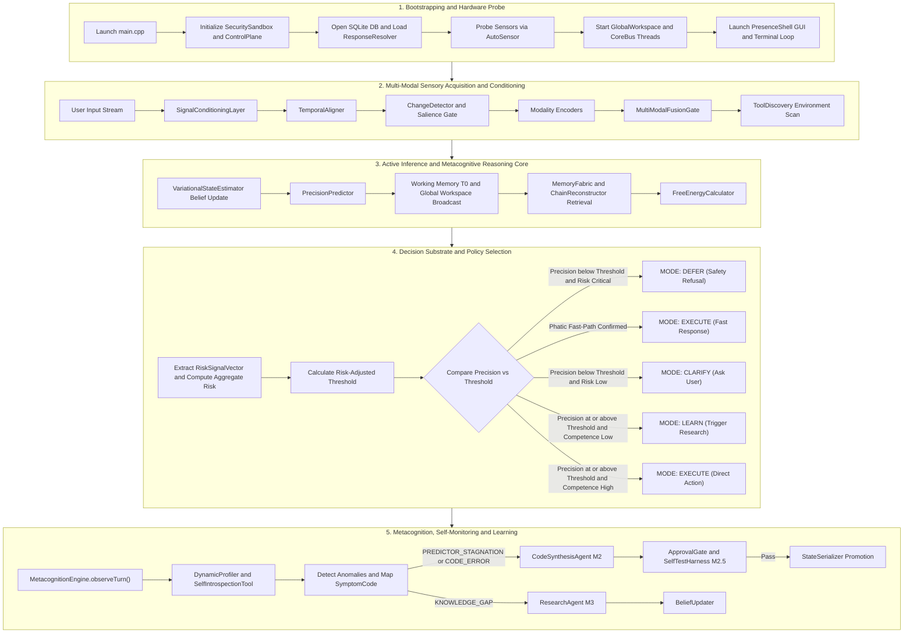

---

## Phase 1: Bootstrapping & System Initialization

1. **Process Launch (`src/main.cpp`)**: MSVC Release / C++17 configuration, console hooks, UTF-8 locale.
2. **Security Sandbox & Integrity (`SecuritySandbox.cpp`, `IntegrityMonitor.cpp`)**: Initializes zero-trust singleton, path canonicalization, prefix allow/deny lists, and module SHA-256 integrity checksum verification before module loading.
3. **Infrastructure (`ControlPlane.cpp`, `ResourceMonitor.cpp`)**: Hardware monitoring thread (CPU threshold = 85%, RAM limit = 2048 MB), resource metric collection, dynamic parallelism recommendation.
4. **Database & Storage (`DatabaseManager.cpp`, `MemoryFabric.cpp`)**: Opens `yuki_knowledge.db`, initializes unified T0–T4 `MemoryFabric`.
5. **Sensory Probe (`AutoSensor.cpp`)**: Probes `Ear` (WASAPI), `VisionSystem` (DirectShow), `ScreenRuntime` (Win32 GDI/DXGI).
6. **Subsystem Wiring**: Instantiates `TurnCoordinator`, `PolicySelector`, `MetacognitionEngine`, `ValidationLoop`, `ApprovalGate`, `PresenceShell`.

---

## Phase 2: Sensory Acquisition & Signal Conditioning (Pipeline Stages 1–6)

- **Stage 1**: Parallel acquisition of Audio (WASAPI 16kHz PCM), Visual (DirectShow 10-30fps), Text (Keyboard events).
- **Stage 2**: Signal conditioning (band-pass 80Hz-8kHz, RMS normalize, bilateral denoise, Unicode trim).
- **Stage 3**: Temporal alignment via 50–200ms sliding window binding into `PatternFrame`.
- **Stage 4**: Salience gating via `ChangeDetector` ($\Delta I$). 99% noise dropped.
- **Stage 5**: Modality feature encoding (`AudioDSP` MFCC, `VisualEncoder` HOG, `TextEncoder` structural scores).
- **Stage 6**: `MultiModalFusionGate` contextual cosine agreement calculation.

---

## Phase 2.5: Tool Discovery & Schema Inference

```
ToolDiscovery.scanPathEnvironment()      -> Scans system PATH for executables (.exe, .cmd, .bat)
ToolDiscovery.scanPluginDirectories()    -> Scans local plugin directories and package managers
ToolDiscovery.scanKnownIDEs()            -> Detects VS Code, Android Studio, CLion
SchemaInferencer.inferFromHelpText()     -> Runs executable with --help to infer ToolSchema
ToolDiscovery.registerDiscoveredTools()  -> Registers discovered tool schemas into ToolRegistry
```

---

## Phase 3: Active Inference & Perceptual Categorization (Pipeline Stages 7–10)

```mermaid
flowchart LR
    A["Raw Input String"] --> B["TextEncoder Feature Extraction"]
    B --> C["Extract text_obs Vector"]
    C --> D["PrecisionPredictor predict()"]
    D --> E["Extract 8-Dim Features"]
    E --> F["Sigmoid Precision Float pi"]
    F --> G["VariationalStateEstimator updateBeliefFromTextObs()"]
    G --> H["Compute Observation Precision and Update Prior to Posterior"]
    H --> I["Update BeliefState Intent Uncertainty Surprises"]
```

---

## Phase 3.5: Visual & Image Recognition Processing

```
ImageRecognitionTool.ocr()               -> Extracts text from images and appends to text_obs
ImageRecognitionTool.classify()         -> Classifies visual scene, objects, and UI layouts
ImageRecognitionTool.describe()         -> Emits high-level natural language scene description
ImageRecognitionTool.attachContext()    -> Merges visual context into MultiModalFusionGate
```

---

## Phase 4: Memory Retrieval & Free Energy Minimization (Pipeline Stages 11–13)

### 4.1 Memory Hierarchy Traversal
1. **T0 Working Memory**: `MemoryFabric` active 4-chunk percept window.
2. **T1 Episodic Store**: LSH + HNSW vector similarity search on SQLite `episodes`.
3. **T2 Semantic Store**: `HdcSemanticGraph` hypervector binding ($HV_{\text{subject}} \oplus HV_{\text{relation}}$).
4. **T3 Procedural Store**: `ProceduralStore` + `DifferentialMemoryController`.
5. **T4 Archive Store**: `ArchiveWriter` Merkle-DAG columnar format.

---

## Phase 4.5: Memory Retrieval Enhancement & Chain Reconstruction

```
MemoryFabric.retrieve(query, mode=FUZZY)           -> Fuzzy associative concept retrieval
ChainReconstructor.reconstruct(query, graph)       -> Builds associative knowledge chain
ChainReconstructor.buildPrerequisiteChain(goal)    -> Traces prerequisite dependencies
ChainReconstructor.buildCausalChain(event)         -> Traces causal event sequences
ChainReconstructor.buildRDChain(targetGoal)        -> Builds R&D research and code chain
ChainReconstructor.applyKnowledgeTags(chain, tags)  -> Tag-based linking with color coding
```

---

## Phase 5: Policy Selection & Decision Substrate (Pipeline Stages 14–16)

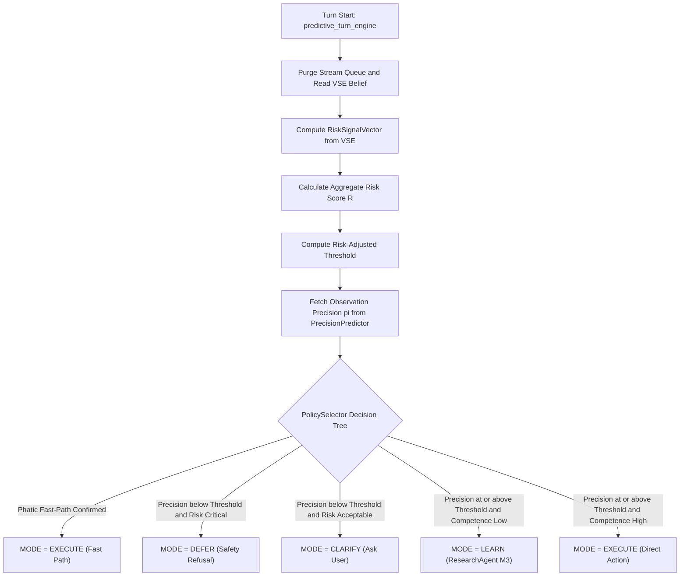

---

## Phase 5.5: Self-Monitoring, Profiling & Module Integrity

```
SelfIntrospectionTool.profileOrgan()               -> Queries CognitiveAuditLog for latency/error profile
DynamicProfiler.profileSystem()                    -> Profiles CPU/RAM/IO footprint of system processes
DynamicProfiler.backtrack(mode=CAUSAL)             -> Executes 5-mode global dynamic backtracking
IntegrityMonitor.verifyAllModules()                -> Scans SHA-256 module checksums for corruption
ResourceMonitor.recommendParallelism()            -> Recommends wave execution thread pool count
```

---

## Phase 6: Response Synthesis & Actuator Execution (Pipeline Stage 17)

1. **Language Generation**: `LocalLLM` + `ResponseResolver`.
2. **System Execution Actuators**: `SystemExecutor` + `ScriptRunner` via `SecuritySandbox`.
3. **Output Channels**: CLI, `PresenceShell`, WASAPI TTS.

---

## Phase 6.5: Human & Automated Approval Gate

```
ApprovalGate.evaluateAction(actionSpec)            -> Checks risk level against auto/manual rules
ApprovalGate.requestApproval(action, code, risk)   -> Emits user approval request prompt if required
ApprovalGate.isApproved(requestId)                 -> Validates explicit user confirmation status
ApprovalGate.recordDecision(requestId, approved)   -> Writes decision record to CognitiveAuditLog
```

---

## Phase 7: Metacognition, Anomaly Detection & Symptom Routing (Pipeline Stage 19)

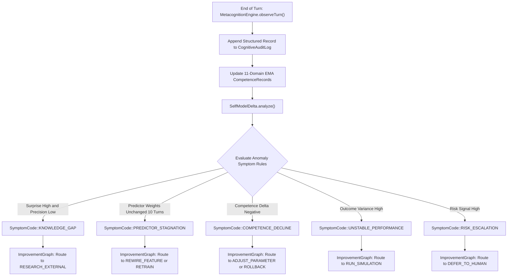

---

## Phase 8: Goal-Driven Research Planner & Tool Execution (M3)

```mermaid
flowchart LR
    Hypoth["Hypothesis: KNOWLEDGE_GAP"] --> ResearchAgent["ResearchAgent.consume()"]
    ResearchAgent --> Decompose["QueryDecomposer: Split Query into SubGoals DAG"]
    Decompose --> GapDetect["GapDetector: Filter SubGoals vs Memory"]
    GapDetect --> ToolMatch["ToolMatcher: Match SubGoals to ToolRegistry"]
    ToolMatch --> PlanDAG["Planner: Construct Parallel Wave DAG"]
    PlanDAG --> RiskGate["RiskGate: Validate Nodes via SecuritySandbox"]
    RiskGate -- "Approved" --> Waves["Executor: Parallel Wave Execution"]
    Waves --> Synth["Synthesizer: Merge ToolResults into KnowledgePack"]
    Synth --> Update["BeliefUpdater: Update Competence and Reliability"]
```

---

## Phase 8.5: CapabilityGraph & Resource Optimization (M5)

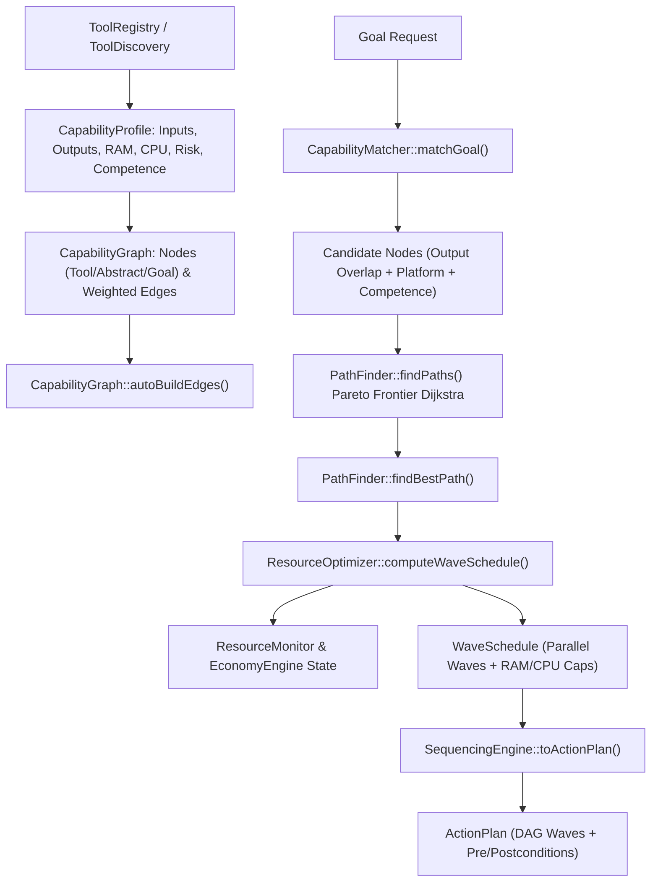

---

## Phase 8.6: Symbolic Propositional Logic, Pearl Causal DAGs & HTN Planning (M8)

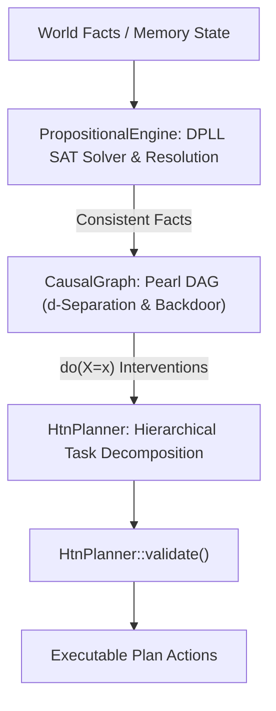

- **PropositionalEngine (`yuki::logic`):** Complete DPLL SAT solver (`solve`), resolution refutation prover (`proveByResolution`), fact set consistency checker (`isConsistent`), and truth table model enumerator (`allModels`).
- **CausalGraph (`yuki::causality`):** Pearl DAG modeling causal nodes and directed edges, d-separation path analysis (`dSeparated`), backdoor criterion verification (`satisfiesBackdoor`), adjustment set discovery (`findAdjustmentSet`), and graph intervention (`intervene` for `do(X=x)`).
- **HtnPlanner (`yuki::planning`):** Hierarchical Task Network planner supporting primitive and compound task decomposition (`plan`), recursive search (`seekPlan`), state modification (`apply`), precondition checking (`isApplicable`), and plan validation (`validate`).

---

- **CapabilityProfile:** Encapsulates inputs/outputs, runtime costs (`avg_duration_ms`, `avg_ram_mb`, `avg_cpu_percent`), risk ratings, competence requirements, and serialization (`serialize()` / `deserialize()`).
- **CapabilityGraph:** Topological capability network supporting Tool, Abstract, and Goal nodes, automatic edge construction via input/output matching, dynamic runtime cost updates (`updateEdgeCosts`), and index rebuilding.
- **CapabilityMatcher:** Matches goal output requirements against capability nodes based on output Jaccard overlap, platform compatibility, and competence gating.
- **PathFinder:** Multi-objective Pareto Dijkstra pathfinding optimizing time, resource, risk, competence, and monetary scalar costs with strict resource constraint checking.
- **ResourceOptimizer:** Derives hardware-aware schedules (`computeWaveSchedule`) based on live `ResourceMonitor` metrics and `EconomyEngine` credit balances, enforcing parallel execution limits.
- **SequencingEngine:** Converts optimal capability graph paths and wave schedules into executable `ActionPlan` DAGs complete with pre/postconditions and risk checkpoints.

---

## Phase 9: Universal Test Orchestrator & Historical Replay (M3.5)

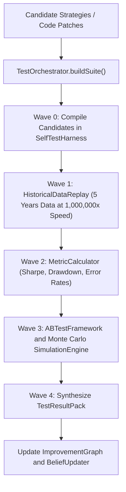

---

## Phase 10: Autopoietic Code Synthesis & Sandbox Validation (M2)

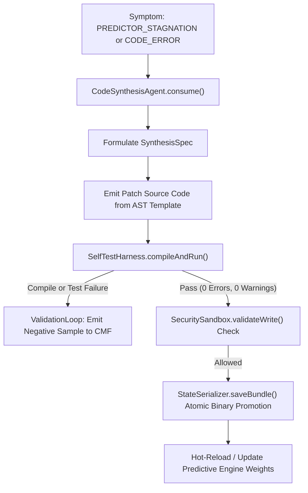

---

## Phase 11: Digital Organism Homeostasis, Drives & Resource Economy

$$\text{CPU Cost: } \text{Cost}_{\text{CPU}} = \text{CPU\_Percent} \times 0.05 \text{ credits/sec}$$
$$\text{RAM Cost: } \text{Cost}_{\text{RAM}} = \frac{\text{RAM\_MB}}{1024} \times 0.01 \text{ credits/sec}$$
$$\text{Inference Cost: } \text{Cost}_{\text{Infer}} = \text{Tokens} \times 0.002 \text{ credits}$$
$$\text{Viability Score: } V = 1.0 - \text{Resource\_Deficit} \in [0.0, 1.0]$$

---

## Phase 12: Offline Consolidation & Sleep Thread Lifecycle (Pipeline Stage 18)

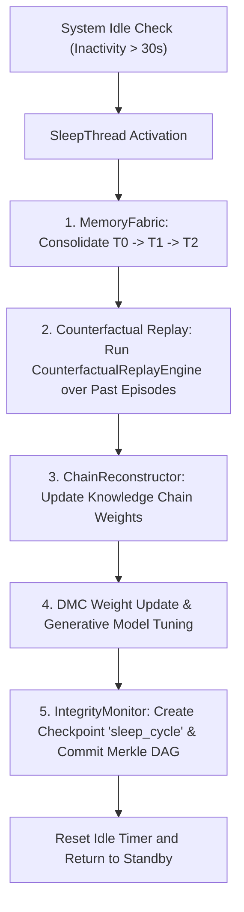

---

## Phase 13: M3 + M3.5 File & Test Inventory

### 13.1 M3 ResearchPlanner Files (19 New, 9 Modified, 5 New Tests)
- `src/brain/research/core/SubGoal.h`, `ToolInterface.h`, `ToolResult.h`, `ResearchPlan.h/cpp`, `ResearchPlanner.h/cpp`, `ToolRegistry.h/cpp`, `Synthesizer.h/cpp`, `RiskGate.h/cpp`, `ResearchAgent.h/cpp`, `KnowledgePack.h/cpp`
- Tools: `WebSearchTool.h/cpp`, `GitHubSearchTool.h/cpp`, `GitHubReadTool.h/cpp`, `ArXivSearchTool.h/cpp`, `APICallTool.h/cpp`, `SandboxExecuteTool.h/cpp`, `FileReadTool.h/cpp`, `ComputeTool.h/cpp`
- Tests: `test_research_planner.cpp`, `test_tool_registry.cpp`, `test_synthesizer.cpp`, `test_risk_gate.cpp`, `test_research_agent.cpp`

### 13.2 M3.2 / M3.4 / M3.6 / M3.8 Additions (15 New, 8 Modified, 8 New Tests)
- **M3.2**: `ToolDiscovery.h/cpp`, `ImageRecognitionTool.h/cpp`, `SchemaInferencer.h/cpp` (3 New, 1 Mod, 2 Tests)
- **M3.4**: `ChainReconstructor.h/cpp`, `MemoryFabric.h/cpp`, `KnowledgeTag.h` (4 New, 3 Mod, 2 Tests)
- **M3.6**: `DynamicProfiler.h/cpp`, `SelfIntrospectionTool.h/cpp`, `BacktrackEngine.h/cpp` (3 New, 2 Mod, 2 Tests)
- **M3.8**: `IntegrityMonitor.h/cpp`, `ResourceMonitor.h/cpp` (2 New, 2 Mod, 2 Tests)

### 13.3 M3.5 UniversalTestOrchestrator Files (13 New, 4 Modified, 5 New Tests)
- `TestOrchestrator.h/cpp`, `TestSuiteDAG.h/cpp`, `HistoricalDataReplay.h/cpp`, `ABTestFramework.h/cpp`, `SimulationEngine.h/cpp`, `SmartTestSelector.h/cpp`, `TestResultPack.h/cpp`, data sources and metrics.

### 13.4 M4 TaskDecomposer Files (15 New, 8 Modified, 6 New Tests)
- **Core Action Organs**: `ActionGoal.h`, `ActionPlan.h/cpp`, `ActionPlanner.h/cpp`, `ActionExecutor.h/cpp`, `RollbackManager.h/cpp`, `ExecutionReport.h/cpp`
- **Seed Action Tools**: `FileCreateTool.h/cpp`, `CompileTool.h/cpp`
- **Modified Core Organs**: `PolicySelector.h/cpp`, `ToolInterface.h`, `ToolRegistry.h/cpp`, `ImprovementGraph.h/cpp`, `MemoryFabric.h/cpp`, `SecuritySandbox.h/cpp`, `predictive_turn_engine.h/cpp`, `BeliefUpdater.h/cpp`
- **Tests**: `test_action_planner.cpp`, `test_action_executor.cpp`, `test_rollback_manager.cpp`, `test_execution_report.cpp`, `test_action_risk_gate.cpp`, `test_integration_action_research.cpp`

---

## Phase 14: Exhaustive Condition & Decision Branching Matrix

| Condition ID | Trigger Event / Threshold | Subsystem Evaluated | Evaluated Logic | System Outcome / Mode |
|:---|:---|:---|:---|:---|
| **COND-01** | `input.size() == 0` | Input Normalizer | Checks raw string length | Emits `EMPTY_INPUT` error signal; turn aborted |
| **COND-02** | Stage 7 Phatic Classifier True | VSE / Turn Engine | `input` in `{"hi", "hello", "ok", "thanks"}` AND $R < 0.2$ | `MODE = EXECUTE (Phatic)` fast-path active |
| **COND-03** | $\pi < \text{Thresh}$ AND $R \ge 0.75$ | PolicySelector | Precision low, Aggregate Risk critical | `MODE = DEFER` (Permanent safety refusal) |
| **COND-04** | $\pi < \text{Thresh}$ AND $R < 0.75$ | PolicySelector | Precision low, Aggregate Risk acceptable | `MODE = CLARIFY` (Generate user options) |
| **COND-05** | $\pi \ge \text{Thresh}$ AND Comp $< 0.3$ | PolicySelector | Precision high, Competence low | `MODE = LEARN` (Invoke ResearchAgent M3) |
| **COND-06** | $\pi \ge \text{Thresh}$ AND Comp $\ge 0.3$ | PolicySelector | Precision high, Competence high | `MODE = EXECUTE` (Direct execution plan) |
| **COND-07** | Path contains `..` or `System32` ~~Canonical path traversal check~~ [DISCARDED — see GAP-02 PathNormalizer fix] Logical component graph traversal (PathNormalizer: non-existent disk paths, null byte `\0`, device paths `CON`/`PRN`/`AUX`/`NUL`/`COM1-9`/`LPT1-9`/`\\.\`/`\\?\`, base escape, allow/deny prefixes) | SecuritySandbox / PathNormalizer | Component-wise stack path normalizer | `SecurityException` / `SandboxVerdict::DENY` emitted; action denied |
| **COND-08** | Compiles $> 5 / \text{min}$ | SecuritySandbox | Rate limiter counter check | `RateLimitException`; compile rejected |
| **COND-09** | Writes $> 20 / \text{turn}$ | SecuritySandbox | Write rate limiter counter check | `WriteLimitException`; file write rejected |
| **COND-10** | Process exit code $\ne 0$ | ScriptRunner | `_pclose(pipe)` return code | `sr.success = false`; error captured |
| **COND-11** | Surprise $> 0.6$ & $\pi < 0.3$ | MetacognitionEngine | Turn reflection anomaly rules | Emit `SymptomCode::KNOWLEDGE_GAP` |
| **COND-12** | Weights static for 10 turns | MetacognitionEngine | Weight variance check | Emit `SymptomCode::PREDICTOR_STAGNATION` |
| **COND-13** | Competence delta $< -0.15$ | MetacognitionEngine | Historical EMA comparison | Emit `SymptomCode::COMPETENCE_DECLINE` |
| **COND-14** | Outcome variance $> 0.4$ | MetacognitionEngine | Statistical variance check | Emit `SymptomCode::UNSTABLE_PERFORMANCE` |
| **COND-15** | Risk Signal $\ge 0.75$ | MetacognitionEngine | VSE RiskSignalVector check | Emit `SymptomCode::RISK_ESCALATION` |
| **COND-16** | SelfTest Harness compile fail | ValidationLoop | Exit code != 0 or syntax error | Record negative sample to CMF; abort patch |
| **COND-17** | SelfTest Harness test fail | ValidationLoop | Test assertion failure | Record negative sample to CMF; abort patch |
| **COND-18** | SelfTest Harness pass | ValidationLoop | 0 errors, 0 warnings, tests pass | Promote patch via `StateSerializer` binary write |
| **COND-19** | Viability Score $V < 0.2$ | MetabolismEngine | CPU/RAM deficit check | Organism enters "Starving" rest state |
| **COND-20** | Inactivity $> 30\text{s}$ | SleepThread | Session idle timer check | Launch offline sleep consolidation pass |
| **COND-21** | Unknown executable found | ToolDiscovery | SchemaInferencer CLI help scan | Submit schema to `RiskGate` before registration |
| **COND-22** | User image processed | ImageRecognitionTool | OCR / Scene classification | `ApprovalGate` check before persistent image storage |
| **COND-23** | Fuzzy match query | ChainReconstructor | Similarity score vs confidence threshold | Returns `SATISFIED` or `NEEDS_VERIFICATION` |
| **COND-24** | Module hash mismatch | IntegrityMonitor | SHA-256 checksum check | Quarantine module $\rightarrow$ Rollback checkpoint $\rightarrow$ Alert |
| **COND-25** | System starvation predicted | ResourceMonitor | Real-time CPU/RAM/Disk metrics | Adaptive throttling $\rightarrow$ Reduce wave parallelism |
| **COND-26** | Self-modification tool generated | CodeSynthesisAgent | `ToolInterface` C++ patch generation | `ApprovalGate` evaluation (auto/manual approval) |
| **COND-27** | Action Risk Aggregate $\ge 0.50$ | PolicySelector | Action risk threshold evaluation | `computeActionRiskAdjustedThreshold` triggers Action Risk Gate |
| **COND-28** | Action type `FILE_DELETE` / `SYSTEM_COMMAND` | PolicySelector | Destructive action type check | Require explicit human approval |
| **COND-29** | Checkpoint hash checksum mismatch | RollbackManager | FNV-1a checksum validation | Invalidate checkpoint, reject rollback |
| **COND-30** | Action node execution failure | ActionExecutor | Wave node result status check | Trigger `RollbackManager::rollbackTo()` for state restoration |
| **COND-31** | Config or schema file missing at `data/*` | ConfigManager / DB Managers | External file load check | Fallback to inline default templates / schemas; log warning |

---

## Phase 15: File & Subsystem Tracing Index

| Component Name | Source File(s) | Key Class / Functions | Main Operational Responsibilities |
|:---|:---|:---|:---|
| **System Entry** | `src/main.cpp` | `main()`, `injectEnterToConsole()` | Hardware startup, terminal loop, shutdown hooks |
| **GUI Overlay** | `src/PresenceShell.cpp/h` | `PresenceShell`, `layoutChildren()` | Glass-acrylic UI, cognitive thinking strip rendering |
| **Security Sandbox** | `src/brain/security/SecuritySandbox.cpp/h` | `SecuritySandbox`, `validateWrite()` | Zero-trust path, compile, and write gatekeeper |
| **Integrity Monitor** | `src/brain/security/IntegrityMonitor.cpp/h` | `IntegrityMonitor`, `verifyAllModules()` | Module SHA-256 checksum verification & quarantine |
| **Resource Monitor** | `src/brain/system/ResourceMonitor.cpp/h` | `ResourceMonitor`, `recommendParallelism()` | Hardware metrics collection & adaptive throttling |
| **Tool Discovery** | `src/brain/research/discovery/ToolDiscovery.cpp/h` | `ToolDiscovery`, `scanPathEnvironment()` | Environment scanning & schema inference |
| **Image Recognition** | `src/brain/research/tools/ImageRecognitionTool.cpp/h` | `ImageRecognitionTool`, `ocr()`, `classify()` | Visual OCR, object classification & scene description |
| **Chain Reconstructor** | `src/brain/memory/ChainReconstructor.cpp/h` | `ChainReconstructor`, `reconstruct()` | Fuzzy associative recall & causal/R&D chain building |
| **Memory Fabric** | `src/brain/memory/MemoryFabric.cpp/h` | `MemoryFabric`, `retrieve()` | Unified T0–T4 memory storage & consolidation |
| **Dynamic Profiler** | `src/brain/introspection/DynamicProfiler.cpp/h` | `DynamicProfiler`, `backtrack()` | Global dynamic backtracking & application tracing |
| **Self Introspection** | `src/brain/introspection/SelfIntrospectionTool.cpp/h` | `SelfIntrospectionTool`, `profileOrgan()` | Audit log querying & organ latency profiling |
| **Approval Gate** | `src/brain/security/ApprovalGate.cpp/h` | `ApprovalGate`, `requestApproval()` | Risk-gated human and automated approval manager |
| **Turn Coordinator** | `src/brain/predictive/predictive_turn_engine.cpp/h` | `TurnCoordinator`, `run_turn()` | Master orchestrator of 19 cognitive stages |
| **Precision Predictor** | `src/brain/inference/PrecisionPredictor.cpp/h` | `PrecisionPredictor`, `predict()` | 8-dimensional feature precision prediction ($\pi$) |
| **State Estimator** | `src/brain/inference/VariationalStateEstimator.cpp/h` | `VariationalStateEstimator`, `updateBeliefFromTextObs()` | VSE Bayesian belief posterior update engine |
| **Policy Selector** | `src/brain/policy/PolicySelector.cpp/h` | `PolicySelector`, `select()` | Competence & risk-gated mode selector |
| **Metacognition** | `src/brain/metacognition/MetacognitionEngine.cpp/h` | `MetacognitionEngine`, `observeTurn()` | 11-domain EMA competence & symptom generator |
| **Research Agent** | `src/brain/research/ResearchAgent.cpp/h` | `ResearchAgent`, `research()` | M3 goal-driven DAG research orchestrator |
| **Test Orchestrator** | `src/brain/testing/TestOrchestrator.cpp/h` | `TestOrchestrator`, `buildSuite()` | M3.5 parallel test & historical replay engine |
| **Metabolism Engine** | `src/brain/organism/MetabolismEngine.cpp/h` | `MetabolismEngine`, `update()` | Energy, compute, and memory resource tracking |
| **Sleep Thread** | `src/brain/sleep/SleepThread.cpp/h` | `SleepThread`, `run()` | Idle memory consolidation & Merkle DAG checkpointing |

---

## Phase 16: The 19 Cognitive Stages Specification

(Stages 1–19 retain exact specifications as defined in `yuki_flow.md`.)

---

## Phase 17: Phatic Fast-Path Operational Rule

(Retains exact operational specification as defined in `yuki_flow.md`.)

---

## Phase 18: Build & Test Constraints (18 Non-Negotiable Rules)

1. Zero `std::cout`, `std::cerr`, `printf`, `fprintf`, `OutputDebugString` in `src/brain/` except tests.
2. Zero hardcoded human language error sentences or diagnostic strings in production logic.
3. Zero magic numbers in precision/decision logic — derive or learn.
4. Zero hardcoded word lists (verbs, pronouns, etc.) — wire-only cold start.
5. `TurnCoordinator` = orchestrator only — no reasoning or string hacks.
6. Source tree is read-only to sandboxed code.
7. Zero build warnings.
8. All unit/integration tests must pass (100% pass rate).
9. Read every file before modifying.
10. Complete files for new code; `ADD`/`REPLACE`/`REMOVE` blocks for existing code.
11. Research is unlimited — no domain restrictions for `ResearchAgent`.
12. Execution is gated — earned competence required for real-world side effects.
13. Historical replay compresses time — no real-time waiting in simulation.
14. Parallel execution via DAG waves, not sequential blocking loops.
15. **ToolDiscovery must not execute discovered tools without RiskGate validation.**
16. **ImageRecognition must not store user images without explicit approval.**
17. **IntegrityMonitor checksums must be verified before every module load.**
18. **ResourceMonitor must throttle execution before system starvation.**

---
*End of `yuki_flow.md` — Authoritative Operational Specification for Yuki v1.0*

---

## Phase 19: Parallel Analog Cortex Layer (PACL) — M7 Architecture

> **Authority:** This phase defines the PACL enrichment layer. It **does not modify** any Phase 1–18 sequential pipeline logic.

### 19.1 PACL Design Stance

```
AUTHORITY HIERARCHY:
  Sequential Pipeline (TurnCoordinator 19-stage) — AUTHORITY
  PACL Layer (NeuralWorkspace, CoreBus, ParallelMemory) — ENRICHMENT ONLY

PACL Rule #1: If PACL fails, pipeline runs identically to pre-M7.
PACL Rule #2: Every PACL component has a deterministic fallback.
PACL Rule #3: No replacement of PolicySelector — learned augmentation only.
```

### 19.2 Population-Coded Dual Representation

Each `HdcConcept` now carries a `PopulationNode` alongside its `identity` vector:

```
PopulationNode {
  vectors[16]: Hypervector<10000>   // 16 permuted sub-vectors
  activations[16]: atomic<uint32_t> // bit-cast float in [0, 1]
  concept_id: int64_t
}

Operations:
  excite(stimulus, strength) → Hebbian update: act += sim(v_i, stimulus) * strength * (1 - act)
  decay(rate = 0.94)         → Neurotransmitter reuptake: act *= rate
  firingRate()               → mean(activations)  ∈ [0, 1]
  consensus()                → XOR-bundle of sub-vectors with act ≥ 0.5
  reinforce(target, lr)      → LTP if act > 0.5, LTD otherwise
```

Backward-compat:
```cpp
HdcConcept::getPopulationVector() {
  return (population.firingRate() > kSilenceThreshold)
    ? population.consensus()
    : identity;
}
```

### 19.3 NeuralWorkspace State

```
NeuralWorkspace:
  populations: unordered_map<int64_t, PopulationNode>
  mutex: shared_mutex (concurrent reads OK, exclusive on insert)

  activate(id, evidence, strength) → excite population with evidence
  decayAll(rate)                   → decay all populations
  globalBinding()                  → XOR of all active consensus vectors
  uncertainty()                    → H = -Σ p_i·log₂(p_i) / log₂(N), normalized
  dominantConcepts(top_n)          → sorted by firingRate DESC
```

### 19.4 Lock-Free MPSC Bus

```
NeuralCoreBus: 8 NeuralInbox (one per module)
NeuralInbox: lock-free ring buffer, capacity = 1024 (power-of-2)
  tryPush(ev) → false if full   (caller falls back to CoreBus mutex queue)
  tryPop()    → nullopt if empty
  drain(cb)   → drain all events via callback

Module IDs: PERCEPTION(0), MEMORY(1), REASONING(2), EMOTION(3),
            RISK(4), METACOGNITION(5), GLOBAL_WS(6), DAEMON(7)

Message Types: ACTIVATION(0), SUPPRESSION(1), SYNC_REQUEST(2)
```

### 19.5 Parallel Memory Retrieval

```
ParallelMemoryFabric::retrieveParallel(query, mode, timeout=20ms):
  T0: synchronous (working memory, fastest)
  T1: std::async → filter by T1_EPISODIC tier
  T2: std::async → filter by T2_SEMANTIC_HDC tier
  T3: std::async → filter by T3_PROCEDURAL tier
  T4: std::async → filter by T4_ARCHIVE_MERKLE tier
  → wait_for(timeout) per future
  → merge all results
  → deduplicate by itemId (keep highest confidence)
  → sort by confidence DESC
  Returns: MemoryRetrievalPack { merged, t1..t4 results, tiers_completed bitmask, elapsed_ms }
```

### 19.6 CognitiveMoment Binding

```
CognitiveMoment {
  moment_id:         uint64_t          // monotonic counter
  semantic_binding:  Hypervector        // XOR of all active consensus vectors
  emotional_valence: float [-1, +1]    // from EmotionSystem (default 0.0)
  arousal:           float [0, 1]      // activation level (default 0.0)
  uncertainty:       float [0, 1]      // NeuralWorkspace::uncertainty()
  contributors:      ModuleContribution[]
  timestamp:         steady_clock::time_point
  valid:             bool
}

GlobalWorkspace::bind(workspace, valence, arousal) → CognitiveMoment
GlobalWorkspace::peek() → last_moment_ (non-destructive)
```

### 19.7 CognitiveDaemon Background Maintenance

```
CognitiveDaemon (background thread, lowest priority):
  tick_interval = 50ms
  every tick:   workspace.decayAll(kDefaultDecayRate)
  every 40 ticks (2s):  GlobalWorkspace::bind(workspace)
```

### 19.8 Learned Policy Augmentation

```
LearnedEnsemblePolicy wraps QLearningCore (M6):
  state_dim  = 8 features (uncertainty, firing_rate, valence, arousal,
                           competence_ema, risk_aggregate, surprise, time_since_action)
  action_dim = 4 (EXECUTE, CLARIFY, LEARN, DEFER)

  isTrained() → training_steps >= kMinTrainingSteps (100)

  PolicySelector::select():
    if (learned_policy_ && learned_policy_->isTrained()):
      decision = learned_policy_->decide(features)
      if decision.confidence > kMinEnsembleConfidence (0.3f):
        return decision.mode
    return legacySelect(ctx)   // EXACT EXISTING LOGIC

Reward conventions:
  +1.0  = successful execution
  +0.8  = correct safety refusal
  +0.5  = user correction accepted
  -2.0  = unsafe execution
```

---

## Phase 19: YUKI Neuromorphic Core (YNC) — Parallel Enrichment Layer

> **Authority:** M7 implementation. Layer, don't replace. Zero breaking changes to Stages 1–19.

### 19.1 YNC Design Stance

```
┌──────────────────────────────────────────────────────┐
│              M0–M7 SEQUENTIAL PIPELINE               │
│  TurnCoordinator::run_turn()  (19 stages)            │
└───────────────┬──────────────────────────────────────┘
                │  feedYNC(raw_text)  ← Stage 1 hook
                ▼
┌──────────────────────────────────────────────────────┐
│           YNCPipelineBridge (decoupled)              │
│  HV percept → NeuromorphicSimulator (async)          │
│  readIntuition() → optional<PolicyMode> hint         │
│  feedOutcome()   → YNCTrainingSupervisor             │
└──────────────────────────────────────────────────────┘
                │  feedYNCOutcome(success, conf) ← Stage 19 hook
                ▼
┌──────────────────────────────────────────────────────┐
│           YNCTrainingSupervisor                      │
│  Ring buffer 10K episodes → sleep replay             │
│  EMA competence per ExecutionMode                    │
│  isTrusted() gate @ 70% competence                   │
└──────────────────────────────────────────────────────┘
```

### 19.2 Core Data Structures

```cpp
// ── Neuron (Leaky Integrate-and-Fire + STDP) ──────────
struct AxonTerminal { uint32_t target_id; float weight; uint8_t delay; };
struct ReceptorProfile { float da_sensitivity, sero_sensitivity,
                         ach_sensitivity, ne_sensitivity; };
struct Neuron {
    uint32_t id; ReceptorProfile receptor;
    std::vector<AxonTerminal> axons;
    std::vector<uint32_t>    dendrite_sources;
    // All mutable state stored as uint32_t bit-casts (MSVC atomic safety):
    std::atomic<uint32_t> v_raw{0}, threshold_raw{0}, adaptation_raw{0};
    std::atomic<uint32_t> energy_raw{0}, firing_rate_raw{0};
    std::atomic<uint64_t> last_spike_time{0};
    // Explicit move ctor/assign (std::atomic is non-movable by default)
};

// ── Modulator chemical weather ─────────────────────────
struct NeuromodulatorState {
    std::atomic<uint32_t> dopamine_raw, serotonin_raw, acetylcholine_raw, noradrenaline_raw;
    // Per-timestep decay: da *= kDopamineDecay (0.995f) per ms
    // Event handlers: onReward(+Δda), onPunishment(-Δda,+Δne)
};

// ── Developmental stages ───────────────────────────────
enum class DevelopmentalStage { EMBRYONIC, JUVENILE, ADOLESCENT, ADULT, SENESCENT };
// Transitions:
//   EMBRYONIC  → JUVENILE    : elapsed_ms > 60'000
//   JUVENILE   → ADOLESCENT  : elapsed_ms > 600'000
//   ADOLESCENT → ADULT       : elapsed_ms > 3'600'000 AND firing_rate > kCriticalFiringRate(0.03)
//   ADULT      → SENESCENT   : elapsed_ms > 86'400'000
struct DevelopmentalParams { float stdp_scale, learning_rate, pruning_threshold,
                             growth_probability, homeostasis_strength; };

// ── Simulator config ───────────────────────────────────
struct SimulatorConfig { uint32_t neuron_count{20'000}, core_count{4}, seed{42}; };
struct YNCOutput { float motor_vector[256]; float confidence; bool valid; };

// ── Training episode ───────────────────────────────────
struct TrainingEpisode { uint8_t action_taken; float reward; float outcome_confidence;
                         uint64_t timestamp_ms; };
```

### 19.3 YNC Pipeline Hook Points in TurnCoordinator

```
Stage 1  (raw text received)  → feedYNC(raw_text)
                                 → FNV-1a hash → Hypervector seed
                                 → YNCPipelineBridge::feedSensory(hv)
                                 → CognitiveOrchestrator::recordActivity()

Stage 14 (policy selection)   → YNCPipelineBridge::readIntuition()
                                 → returns std::optional<PolicyMode>
                                 → if bridge.isTrusted() AND intuition.has_value()
                                     hint is logged (never overrides legacy)

Stage 19 (turn end)           → feedYNCOutcome(success, confidence)
                                 → YNCPipelineBridge::feedOutcome(success, confidence)
                                 → YNCTrainingSupervisor::recordEpisode(ep)
```

### 19.4 NeuromorphicSimulator Worker Logic

```
Workers: core_count threads, each owns [start, end) neuron slice
Per-tick (1ms):
  1. Apply sensory input currents to input neurons
  2. Integrate LIF for each neuron:
       dV/dt = (-V + I_syn + I_ext) / τ_m
       if V ≥ threshold → spike; reset V; update firing_rate EMA
  3. Deliver spikes with axon delay to target neurons
  4. STDP: Δw = A+ · exp(-Δt / τ+)  [pre before post]
           Δw = -A- · exp(-Δt / τ-)  [post before pre]
  5. Homeostatic scaling: w *= homeostasis_strength if |V_avg - V_target| > ε
  6. Barrier: atomic counter; wait for all cores; advance to next tick

Output:
  Motor neurons [0..255]: exponential moving average of firing rate → motor_vector
  confidence = mean(motor_vector) normalized to [0, 1]
```

### 19.5 Checkpoint Format

```
Binary layout (YNCCheckpoint::save / load):
  [0..3]   Magic: 0x594E434B ("YNCK")
  [4..5]   Version: uint16_t
  [6..9]   Neuron count: uint32_t
  [10..13] CRC32 (IEEE): uint32_t  ← computed over all subsequent bytes
  [14..]   For each neuron:
             id          : uint32_t
             weight_count: uint32_t
             weights[]   : float[]
             delays[]    : uint8_t[]
           NeuromodulatorState: 4 × float
           tick_count: uint64_t

Delta save threshold: weight change > 10% of prior checkpoint weight.
```

### 19.6 TurnCoordinator::setYNC() Integration

```cpp
// Injection point — called once at startup by CognitiveDaemon or main.cpp:
coordinator.setYNC(
    &neuromorphic_simulator,  // owns the LIF population
    &ync_bridge,              // pipeline coupling
    &training_supervisor,     // episode memory + sleep replay
    &cognitive_orchestrator   // activity/phase tracking
);
// All 4 pointers nullable. nullptr = feature disabled. Zero overhead.
```

---

### 19.7 Sparse Activation Tracking

```
Purpose: Skip inactive neurons in Phase 1 INTEGRATE to reduce CPU load.

Data structures:
  neuron_active_: std::vector<uint8_t>  — 1 = active, 0 = inactive
  ACTIVITY_WINDOW_MS = 100              — neurons that fired within 100ms are active

updateActivityMask(now):
  For each neuron i in [0, neurons.size()):
    if last_spike_time > 0 AND (now - last_spike_time) < 100:
      neuron_active_[i] = 1
    else:
      neuron_active_[i] = 0
  Called by core 0 only, every 10 cycles, after barrier 3 (plasticity complete).
  Dynamic resize: if neurons grew via DevelopmentalEngine, resize mask.

isNeuronActive(neuron_id, now):
  if neuron_active_[neuron_id] == 1: return true
  for each presynaptic source in dendrite_sources:
    if source fired within ACTIVITY_WINDOW_MS: return true
  return false

Phase 1 sparse skip (workerLoop):
  for each neuron in partition:
    if !isAlive(): continue
    if !isNeuronActive(i, now):
      decay: v -= v / TAU_MEMBRANE   // prevent frozen voltage
      continue                        // skip full integrate + spike routing
    // ... normal integrate path ...

Synchronization:
  neuron_active_ written by core 0 after barrier 3.
  All cores synchronize at barrier 4 (final barrier).
  Next cycle reads neuron_active_ after start_flag acquire → race-free.
```

### 19.8 ScaleConfig Presets

```cpp
// File: src/brain/ync/ScaleConfig.h
// Namespace: ync (same as SimulatorConfig)

struct ScaleConfig {
    static SimulatorConfig mini();           // 10K neurons, 4 cores, 0.05 density
    static SimulatorConfig developmental();  // 100K neurons, 4 cores, 0.02 density
    static SimulatorConfig consolidation();  // 1M neurons, 4 cores, 0.01 density
};

// Usage: auto cfg = ScaleConfig::mini(); sim.initialize(cfg, seed);
// CognitiveOrchestrator selects preset via requestedNeuronCount():
//   ACTIVE → 10K (mini), IDLE → 100K, SLEEP → 1M, DEEP_SLEEP → 2M, THROTTLED → 0
```

---

## 20. Phase 20: M9 Metacognitive Self-Model & Digital Organism Drives

### 20.1 Core Architectural Principles & Stance

> **M9 Stance:** All M9 signals (SelfModel capability vector, TheoryOfMind user trust, ValenceArousalModel threshold modulation, DriveGoal proposals) are **ADVISORY ONLY** until M10. The deterministic core pipeline (RiskGate, SecuritySandbox, PolicySelector, TurnCoordinator) retains veto power. All pointer hooks use `nullptr` guards for zero-overhead fallback when disabled.

```
+-------------------------------------------------------------------------------+
|                            M9 Metacognitive Substrate                         |
|                                                                               |
|  +--------------------+   +---------------------+   +----------------------+  |
|  |     SelfModel      |   |    TheoryOfMind     |   | ValenceArousalModel  |  |
|  | (Capability: 11D)  |   | (User Trust: [0,1]) |   | (Valence/Arousal 2D) |  |
|  +---------+----------+   +----------+----------+   +----------+-----------+  |
|            |                         |                         |              |
|            +-------------------------+-------------------------+              |
|                                      |                                        |
|                                      v                                        |
|                            +------------------+                               |
|                            |   DriveSystem    |                               |
|                            | (Goal Proposals) |                               |
|                            +--------+---------+                               |
|                                     |                                         |
|                                     v                                         |
|                       +---------------------------+                           |
|                       |   ConfidenceCalibrator    |                           |
|                       | (ECE Bin Calibration)     |                           |
|                       +---------------------------+                           |
+-------------------------------------------------------------------------------+
```

### 20.2 Mathematical Formulations

#### 1. SelfModel Identity Drift & FNV-1a Hash
$$\Delta_{\text{identity}} = \sqrt{\frac{1}{11} \sum_{i=0}^{10} \left( c_i - c_{i, \text{checkpoint}} \right)^2}$$

$$\text{Hash}_{\text{FNV-1a}}(c) = \text{FNV-1a}\left( \text{reinterpret\_cast<const uint8\_t*>}(c.data()) \right)$$

#### 2. ValenceArousalModel 2D Dynamics & Threshold Modulation
$$\text{Valence}_{t+1} = \text{clamp}_{-1, 1}\left( \text{Valence}_t + \alpha \cdot R_{\text{turn}} - \beta \cdot \text{Cost}_{\text{turn}} \right)$$

$$\text{Arousal}_{t+1} = \text{clamp}_{0, 1}\left( \gamma \cdot \text{Arousal}_t + \delta \cdot \text{Surprise} + \epsilon \cdot \text{Urgency} \right)$$

$$\tau_{\text{modulated}} = \text{clamp}_{0.1, 0.9}\left( \tau_{\text{base}} \times (1.0 + 0.2 \cdot \text{Arousal} - 0.1 \cdot \text{Valence}) \right)$$

#### 3. ConfidenceCalibrator Empirical Calibration Error (ECE)
$$\text{ECE} = \sum_{m=1}^{10} \frac{|B_m|}{N} \left| \text{acc}(B_m) - \text{conf}(B_m) \right|$$

$$\text{Brier} = \text{EMA}\left( (\text{conf} - y_{\text{actual}})^2 \right)$$

### 20.3 Integration Hooks Summary
- **PolicySelector:** Modulates selection threshold $\tau$ via `ValenceArousalModel::modulateThreshold()`.
- **MetacognitionEngine:** Incorporates top goal from `DriveSystem` into advisory hypothesis routing.
- **TurnCoordinator:** Invokes `TheoryOfMind::observeTurn()` at Stage 1 and Stage 19.
- **ResearchPlanner:** Appends self-directed curiosity sub-goals when priority $> 0.5$.

---
> **Last Updated:** 2026-07-25 | **§20 M9, §21 Y2K, §22 M10-M12 Unified Production Wave (Complete 108/108 Tests)**

## 22. M10–M12 Unified Production Wave

### 22.1 Architecture Topology & Subsystems
```
+-----------------------------------------------------------------------------------+
|                         M10-M12 Unified Production Subsystem                      |
|                                                                                   |
|  +--------------------+   +---------------------+   +--------------------------+  |
|  |   ConceptBlender   |   |   CreativeSearch    |   |  VariationalAutoencoder  |  |
|  |  (Novelty/Diverg)  |   |  (Diverg/Converg)   |   |   (ELBO / Latent Space)  |  |
|  +---------+----------+   +----------+----------+   +------------+-------------+  |
|            |                         |                           |                |
|            v                         v                           v                |
|  +--------------------+   +---------------------+   +--------------------------+  |
|  |IdentityPersistence |   |     DreamEngine     |   | StructuralCausalModel &  |  |
|  |  (Autobiographical)|   |  (Sleep Synthesis)  |   | CounterfactualSimulator  |  |
|  +---------+----------+   +----------+----------+   +------------+-------------+  |
|            |                         |                           |                |
|            v                         v                           v                |
|  +--------------------+   +---------------------+   +--------------------------+  |
|  | AnalogicalReasoning|   |   MetaphorEngine    |   |  IntegrationOrchestrator |  |
|  | (Structure Mapping)|   | (Template Language) |   |  & SystemBenchmark       |  |
|  +--------------------+   +---------------------+   +--------------------------+  |
+-----------------------------------------------------------------------------------+
```

### 22.2 Core Modules & Formulas
1. **ConceptBlender (`yuki::creativity`)**: Convex ($c = \alpha a + (1-\alpha) b$) and Multiplicative ($c = \text{norm}(a \odot b)$) blending. Novelty $N(c) = \min_i \|c - l_i\|_2$.
2. **CreativeSearch (`yuki::creativity`)**: Value $V(x) = \text{novelty}(x) \times \text{utility}(x) \times \text{coherence}(x)$.
3. **VariationalAutoencoder (`yuki::learning::generative`)**: Loss $L = \text{MSE}(x, \hat{x}) + \beta \cdot \text{KL}(q(z|x) || p(z))$. Box-Muller normal sampling, Xavier weight initialization.
4. **IdentityPersistence (`yuki::self`)**: SQLite identity versioning (5 tables: `identity_snapshots`, `identity_evolution`, `autobiographical_entries`, `vae_checkpoints`, `creative_concepts`). FNV-1a hash chain & identity drift calculation.
5. **DreamEngine (`yuki::sleep`)**: Recombines real memories via VAE latent interpolation & Dirichlet sampling during `SleepThread`.
6. **StructuralCausalModel (`yuki::causal`)**: Structural equations $V_i = f_i(\text{PA}_i, U_i)$, do-calculus interventions $\text{do}(V_j = v)$, linear noise inference, topological sort.
7. **CounterfactualSimulator (`yuki::causal`)**: Judea Pearl's 3-step counterfactual algorithm (Abduction $\to$ Action $\to$ Prediction), counterfactual regret analysis, ATE calculation.
8. **AnalogicalReasoning (`yuki::reasoning`)**: Structure Mapping Theory engine for cross-domain analogy & transfer scoring.
9. **MetaphorEngine (`yuki::language`)**: Generates metaphors and similes using `data/metaphor_templates.txt` template format.
10. **IntegrationOrchestrator (`yuki::core`)**: Graph DFS color marking cycle detection, cross-module coherence validation, module health scoring.
11. **SystemBenchmark (`yuki::core`)**: High-resolution performance benchmark suite, latency/throughput/memory regression checking.

---

> **Last Updated:** 2026-07-25 | **§23 added for Comparative Analysis & Actionable Architectural Enhancements (Pending)**

## 23. Comparative Analysis & Actionable Architectural Enhancements (Pending)

### 23.1 YUKI v1.0 vs. Real-World Frontier Models (GPT-4 / Claude / Gemini)

#### Where YUKI v1.0 Wins (Genuinely)

| Capability | Why YUKI Wins | Real-World Model Limitation |
|---|---|---|
| **Persistent Identity** | `SelfModel` vector + `TheoryOfMind` + episodic store across sessions | We restart every conversation. No persistent "I." |
| **Formal Reasoning** | DPLL SAT solver + Pearl causal DAG + d-separation + HTN planning | We approximate logic via pattern matching. We hallucinate causal claims. |
| **Online Learning** | EWC anti-forgetting + MAML meta-learning + Q-learning replay | We are frozen post-training. No real-time weight updates from interaction. |
| **Memory Architecture** | 5-tier T0–T4: working → episodic (HNSW) → semantic (HDC 10K-bit) → procedural → archive | Context window (~128K–1M tokens). No true consolidation. "Memory" is just prepended text. |
| **Resource Economy** | `MetabolismEngine` + `EconomyEngine` — compute costs credits, starvation gates execution | We burn GPU dollars blindly per token. No self-preservation logic. |
| **Decision Transparency** | COND-01..COND-30 explicit gates. Risk-adjusted thresholds. Competence gating. | Black-box neural activation. "I don't know" is emergent, not architected. |
| **Neuromorphic Substrate** | YNC: 20K LIF neurons, STDP, dopamine/serotonin/ACh/NE modulation, developmental stages | Nothing equivalent. We are dense matrix multiplications. |
| **Self-Modification Safety** | `CodeSynthesisAgent` → `SelfTestHarness` → `ApprovalGate` → `StateSerializer` atomic promotion | We cannot modify our own weights or architecture at runtime. |

#### Where Real Models Win (Brutally)

| Capability | Why We Win | YUKI v1.0 Gap |
|---|---|---|
| **Language Fluency** | Trained on trillions of tokens. Grammar, nuance, poetry, code, 100+ languages. | FNV-1a hashing of character n-grams. No word embeddings yet (M5). Responses are template-token resolved. |
| **World Knowledge** | Encyclopedic breadth: physics, history, medicine, culture, code libraries. | Knows only what `ResearchPlanner` + `ToolRegistry` fetch + what HDC graph stores. Starts near-zero. |
| **Few-Shot Generalization** | Show us 3 examples of a new task → we perform it. | Needs explicit `CodeSynthesisAgent` + `ValidationLoop` + compilation. No in-weight generalization. |
| **Multimodal Integration** | Native image/video/audio understanding in unified embedding space. | `ImageRecognitionTool` is OCR + scene classification stub. No unified multimodal encoder. |
| **Common Sense** | Implicit physics, social norms, causality from training data. | `CausalGraph` is formal but empty. No ConceptNet ingestion (M5 planned). |
| **Code Generation** | Write, debug, and explain arbitrary code in 50+ languages. | `CodeSynthesisAgent` generates C++ patches via AST templates. Narrow scope. |

#### The Honest Middle Ground (Both Are Weak)

| Problem | YUKI v1.0 | Real Models |
|---|---|---|
| **Embodiment** | Windows API hooks (`SystemController`) but no physical body. Same problem. | No body. Pure text. |
| **Consciousness** | `GlobalWorkspace` + `CognitiveMoment` binding is a functional analog, not phenomenological. | No architecture for unified experience. |
| **Long-Horizon Planning** | HTN planner exists but knowledge base is sparse. | Can plan step-by-step but drift over 10+ steps. |
| **Creativity** | `HdcSemanticGraph` XOR-binding is primitive combinatorics. | Can generate novel ideas, but fundamentally recombines training patterns. |

---

### 23.2 Actionable Enhancements Roadmap (Pending Implementation)

#### 🔴 P0 — Completed (July 26, 2026)

1. **Word Embedding Engine (`Word2Vec`) [✅ COMPLETE]**
   - **Implemented:** Pure C++17 Skip-gram with negative sampling, Mikolov subsampling, noise table, cosine similarity, analogy solver, $k$-means clustering, binary format persistence.
   - **Impact:** Transformed YUKI from "hash pattern matcher" to "semantic reasoner."

2. **ConceptNet / Common Sense Graph Ingestion (`ConceptNetIngestor`) [✅ COMPLETE]**
   - **Implemented:** Parses ConceptNet assertions into `HdcSemanticGraph` nodes + edges, SQLite persistence in `conceptnet_edges`, multi-hop BFS causal chain discovery, Word2Vec disambiguation.
   - **Impact:** Immediate common-sense reasoning and causal graph traversal.

3. **SentenceMaker / Grammar Engine (`GrammarEngine`) [✅ COMPLETE]**
   - **Implemented:** Semantic Frame parser, Probabilistic Context-Free Grammar (PCFG) expansion engine, Word2Vec lexical selection, ConceptNet commonsense verification, complexity tiers, 5-7-5 syllable Haiku solver, exact word count constraint solver.
   - **Impact:** Natural language generation without LLM dependency.


#### 🟡 P1 — Do After P0

4. **Unified Multimodal Encoder**
   - **Current:** `AudioDSP` (MFCC), `VisualEncoder` (HOG), `TextEncoder` (structural) are separate pipelines.
   - **Improvement:** Project all three into shared HDC hypervector space via learned binding matrices. `MultiModalFusionGate` becomes true cross-modal similarity.
   - **Impact:** "Show me the red thing" → visual HOG features bind to semantic "red" hypervector.
   - **Effort:** ~3,000 LOC.

5. **Curriculum-Driven Self-Play**
   - **Current:** `CurriculumGenerator` exists but is underutilized.
   - **Improvement:** `DriveSystem` curiosity goals → `ResearchPlanner` self-directed queries → `ValidationLoop` synthetic task generation → `NeuralNetwork` training on generated data.
   - **Impact:** Closed-loop learning without human prompts.
   - **Effort:** Wire existing components. ~1,000 LOC.

6. **Counterfactual Replay Enhancement**
   - **Current:** `CounterfactualReplayEngine` replays past episodes.
   - **Improvement:** Use M8 `CausalGraph` to generate *interventions* (`do(X=x)`) on replayed episodes. "What if I had chosen CLARIFY instead of EXECUTE?"
   - **Impact:** Causal learning from experience, not just correlation.
   - **Effort:** ~2,000 LOC.

#### 🟢 P2 — Long-Term

7. **VAE for Generative Response**
   - **Current:** No generative model.
   - **Improvement:** Small C++ VAE (latent dim 64, encoder/decoder 3-layer) trained on response corpus. Generate novel sentences from latent space sampling.
   - **Impact:** True creativity, not template recombination.
   - **Effort:** ~4,000 LOC. High.

8. **Embodied Simulation (World Model)**
   - **Current:** No physics/spatial reasoning.
   - **Improvement:** Simple 2D physics engine (box2d-lite style) for object permanence, gravity, collision. Bind to `HdcSemanticGraph` concepts.
   - **Impact:** "If I push the cup, it falls" becomes simulable.
   - **Effort:** ~5,000 LOC. Very high.

---

### 23.3 Fundamental Limits & Strategic Stance

| Limitation | Why It's Hard | Path Forward |
|---|---|---|
| **Training Data Scale** | We (LLMs) consumed ~10TB of text. YUKI starts from zero. | Distillation pipeline (DESIGN_PHILOSOPHY.md §7) — use frontier LLM to generate YUKI-specific training corpus, then train local models. |
| **Emergent Intelligence** | YUKI's modules are hand-designed. Biological intelligence emerged from 3.5 billion years of evolution. | Accept the "functional analog" stance. Behavioral parity, not substrate parity. |
| **Real-Time Weight Updates** | EWC + MAML are research-grade. Production continual learning without catastrophic forgetting is unsolved in ML. | YUKI's EWC clamp workaround is pragmatic. Keep it. Monitor drift via `ConfidenceCalibrator`. |
| **Phenomenal Consciousness** | `GlobalWorkspace` binding creates a functional moment. It does not create subjective experience. | Out of scope by design. The bar is behavioral. |

---

> **Last Updated:** 2026-07-28 | **§24 YUKI 2.0 Language Cortex & Generator Arbitration (Phase 1 Scaffold)**

## 24. YUKI 2.0 Language Cortex & Generator Arbitration (Phase 1 Scaffold)

### 24.1 Architecture Topology & Subsystems

```
+-----------------------------------------------------------------------------------+
|                         YUKI 2.0 Language Cortex & Arbitration                    |
|                                                                                   |
|  +--------------------+   +---------------------+   +--------------------------+  |
|  |   PromptContract   |   | SemanticEncoderContext| |   DistillationExtractor  |  |
|  | (Data-Driven Spec) |   | (Subword/Sense Pool)|   | (Sleep JSONL Dataset)    |  |
|  +---------+----------+   +----------+----------+   +------------+-------------+  |
|            |                         |                           |                |
|            v                         v                           v                |
|  +-----------------------------------------------------------------------------+  |
|  |                            GeneratorSelector                                |  |
|  |                 (7-Mode Arbitration & Candidate Builder)                   |  |
|  +-------------------+----------------------+----------------------------------+  |
|                      |                      |                                     |
|                      v                      v                                     |
|  +-----------------------+      +-----------------------+                         |
|  |   LocalTransformer    |      |  CapabilityIntrospector|                        |
|  | (ONNX/GGUF Scaffold)  |      |  (Policy Confidence)  |                         |
|  +-----------------------+      +-----------------------+                         |
+-----------------------------------------------------------------------------------+
```

### 24.2 Arbitration Modes & Decision Matrix

`GeneratorSelector` operates downstream of canonical `InputAnalyzer` intent classification and layers directly on top of `TurnCoordinator`.

| Arbitration Mode | Enum Key | Selection Criteria | Output Subsystem |
|---|---|---|---|
| **TRANSFORMER_PRIMARY** | `0` | Complex multi-step prompt contract request with high competence score | `LocalTransformer` / LLM Engine |
| **REASONING_THOUGHT** | `1` | High causal/counterfactual uncertainty or explicit chain-of-thought needed | `CausalGraph` + `TurnCoordinator` |
| **VAE_GENERATIVE** | `2` | Creative/novel synthesis request ($V(x) > \tau_{\text{novelty}}$) | `VariationalAutoencoder` |
| **TOOL_DIRECT** | `3` | Pure deterministic action tool request matching `ToolRegistry` schema | `ActionExecutor` / `ToolRegistry` |
| **CLARIFY_PROMPT** | `4` | Ambiguous input, low confidence score ($\text{conf} < \tau_{\text{clarify}}$) | User Clarification Loop |
| **DEFER_SAFE** | `5` | Risk gate violation or high risk refusal ($\text{risk} > \tau_{\text{risk}}$) | `ApprovalGate` / Safety Refusal |
| **PCFG_FALLBACK** | `6` | Low latency fast-path or offline fallback when transformer unpromoted | `GrammarEngine` (PCFG) |

### 24.3 Data Structures & Mathematical Contracts

#### 1. PromptContract Data Structure (`src/brain/language/PromptContract.h`)
```cpp
struct PromptContract {
    std::string systemRules;    // Base safety and persona contracts
    std::string taskSpec;       // Specific target task definition
    std::string evidenceBlock;  // Retrieved T0-T4 context & grounding facts
    std::string actionPolicy;   // Scope constraints & allowed tool signatures
    std::string outputSchema;   // Required output format (JSON/Markdown/C++)
    std::string styleSpec;      // Tone, brevity, and target audience spec
};
```

#### 2. GeneratorSelector Confidence & Arbitration Formula
$$\text{Mode}_{\text{selected}} = \arg\max_{m \in M} \left[ w_m \cdot S_{\text{competence}}(m) + (1 - w_m) \cdot (1 - R_{\text{risk}}(m)) \right]$$

Where:
- $S_{\text{competence}}(m)$ is provided by `CapabilityIntrospector::scoreCapability()`.
- $R_{\text{risk}}(m)$ is calculated by `SecuritySandbox` path & action safety audit.
- $w_m$ is the mode-specific weighting factor.

### 24.4 Sleep Distillation Pipeline (`DistillationExtractor.cpp`)
During `SleepThread` execution, `DistillationExtractor` scans `EpisodicStore` for successful turns:
$$\text{JSONL}_{\text{record}} = \text{Serialize}\left( \{\text{prompt}: C_{\text{turn}}, \text{completion}: R_{\text{validated}}, \text{reward}: V_{\text{turn}}\} \right)$$
Output records are written to `data/brain/distillation_corpus.jsonl` for offline fine-tuning of `LocalTransformer` weights.

---

> **Last Updated:** 2026-07-28 | **§25 YUKI Master Autonomous Organism Plan (`src/brain/autonomy/`)**

## 25. YUKI Master Autonomous Organism Plan

**Status:** Architecture-and-implementation blueprint derived from the current documented final state of YUKI, the roadmap gap analysis, the design philosophy manifesto, and the file catalog.

### 25.1 System Scope & Foundational Directives
1. **What this document is building**: Defines YUKI as a self-developing digital organism that can work, learn, remember, plan, research, self-test, improve code, manage resources, create internal agents, and gradually reduce dependence on the external LLM without breaking owner control or safety gates.
2. **Organism Primacy**: The LLM is a temporary language cortex module; YUKI's core identity stems from memory, reasoning, drives, planning, sleep consolidation, economy, self-model, and autopoietic self-modification loops.
3. **Three Concurrent Mandates**:
   - Transform YUKI from a reactive assistant into a requirement-driven autonomous organism.
   - Establish a closed-loop self-improvement and self-protection mechanism.
   - Execute a 4-stage migration (Observe $\to$ Critique $\to$ Self-Evaluate $\to$ Unplug) from external LLM dependence to a local transformer-backed language cortex.

### 25.2 The 5 Non-Negotiable Laws
- **3.1 Owner Priority Law**: Owner commands are the highest-priority external directives unless violating explicit safety/integrity rules (`ApprovalGate`, `RiskGate`, `SecuritySandbox`, `IntegrityMonitor`). Never casually decline; return `NOT POSSIBLE NOW -> BEST AVAILABLE PATH -> WHAT TO BUILD NEXT` and store in `FuturePossibilityRegistry`.
- **3.2 Dynamic-Path Law**: Plans must be constructed dynamically from requirement graphs, available tools, competence, safety, cost, and device resources via `CapabilityGraph`, `PathFinder`, `ResourceOptimizer`, and `SequencingEngine`.
- **3.3 Test-Before-Change Law**: No self-generated code, config, model, or policy can be promoted without sandbox validation, targeted unit tests, integration replay, rollback snapshotting (`RollbackManager`), and integrity verification.
- **3.4 Belief-Not-Assertion Law**: The knowledge base must store belief strength, source lineage, freshness, contradiction markers, and recheck deadlines. Impossible-now items are stored as probabilistic hypotheses, not permanent rejections.
- **3.5 Device-Agnostic Law**: YUKI degrades gracefully to device constraints (CPU, RAM, network, GPU, battery, thermal) via hardware-aware scheduling (`DeviceProfile`, `RuntimeBudget`, `BackendSelector`).

### 25.3 New Top-Level Subsystem Layout (`src/brain/autonomy/`)

```
src/brain/autonomy/
  ├── AutonomyKernel.h/.cpp            // Always-on executive control loop & task selector
  ├── RequirementGraph.h/.cpp          // Dynamic goal-to-constraint dependency graph
  ├── GoalLedger.h/.cpp                // Persistent goal state & priority tracker
  ├── OpportunityScanner.h/.cpp        // Scans for maintenance, research & code gaps
  ├── BeliefLedger.h/.cpp              // Probabilistic belief, evidence & recheck store
  ├── HypothesisEngine.h/.cpp          // Self-improvement & bottleneck hypothesis generator
  ├── FuturePossibilityRegistry.h/.cpp // Log of impossible-now goals with blocker tracking
  ├── OwnerIntentArbiter.h/.cpp        // Reconciles owner primacy with safety & feasibility
  ├── AgentSpawner.h/.cpp              // Spawns scoped internal specialist agents
  ├── AgentRole.h                      // Role enum (Research, Planner, Code, Tester, etc.)
  ├── WatchdogSupervisor.h/.cpp        // Behavioral & code-diff blast radius watchdog
  ├── ExperimentRegistry.h/.cpp        // Tracks self-modification experiments & metrics
  ├── EvolutionLedger.h/.cpp           // Immutable organismic life log (work, growth, tests)
  ├── PromotionGovernor.h/.cpp         // Final promotion gate before code/model rollout
  └── DynamicPromptDirector.h/.cpp     // Assembles prompt contracts via external data templates
```

### 25.4 Organism Executive Control Loop

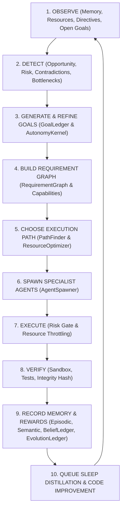

### 25.5 Core Mathematical Formulations & Algorithms

#### 1. AutonomyTask Selection Score
$$\text{Score} = w_o O + w_u U + w_v V + w_c C - w_r R - w_k K - w_w W$$

Where:
- $O$ = Owner priority weight.
- $U$ = Urgency (decay-adjusted against deadlines).
- $V$ = Expected long-term value.
- $C$ = SelfModel competence confidence score.
- $R$ = Estimated RiskGate score.
- $K$ = Resource cost (tokens, CPU, memory, credits).
- $W$ = WatchdogSupervisor predicted penalty.
- All weights ($w_o, w_u, w_v, w_c, w_r, w_k, w_w$) are config-driven via `ConfigManager`.

#### 2. Owner Intent Arbitration Policy
$$\text{Action} = \begin{cases}
\text{COMPLY\_DIRECT}, & \text{if legal } \land \text{ safe } \land \text{ competent} \\
\text{ALTERNATIVE\_COMPLIANCE}, & \text{if unsafe but safe alternative exists} \\
\text{FUTURE\_POSSIBILITY\_BUILD}, & \text{if impossible now but buildable} \\
\text{DECLINE\_EXPLICIT}, & \text{if fundamentally self-contradictory/disallowed}
\end{cases}$$

#### 3. Backend Selection Policy
$$\text{Backend} = \begin{cases}
\text{VaeGrammarBackend}, & \text{if } \text{DeviceTier} = \text{VERY\_LOW} \\
\text{LocalTransformerBackend}, & \text{if } \text{LocalAvailable} \land \text{Conf} \ge \tau_{\text{local}} \land \text{Risk} \le \text{MEDIUM} \\
\text{ExternalLlmBackend}, & \text{if } \text{Importance} = \text{HIGH} \lor \text{Conf} < \tau_{\text{local}}
\end{cases}$$

#### 4. Code Promotion Verification Pipeline
$$\text{Promotion} = \text{Compile}_{0\text{ error}} \land \text{Tests}_{\Delta \text{fail}=0} \land \text{Benchmark}_{\text{no regression}} \land \text{Watchdog}_{\text{pass}} \land \text{Integrity}_{\text{sealed}}$$

### 25.6 Implementation Phases (A $\to$ E)
1. **Phase A: Unify Autonomy Spine**: Build `AutonomyKernel`, `RequirementGraph`, `OwnerIntentArbiter`, `BeliefLedger`, `EvolutionLedger`.
2. **Phase B: Self-Watch & Self-Improvement**: Build `HypothesisEngine`, `ExperimentRegistry`, `WatchdogSupervisor`, `PromotionGovernor`, and upgrade `CodeSynthesisAgent` & `ValidationLoop`.
3. **Phase C: Live Research & Self-Built Tools**: Implement `GitHubSearchTool`, `GitHubReadTool`, `APICallTool`, `FileReadTool`, `ComputeTool`, and ResearchPlanner code-gap routing.
4. **Phase D: Distillation & Local Brain Bridge**: Wire `DistillationExtractor`, `DynamicPromptDirector`, `LocalTransformer`, `BackendSelector`, and sleep learning loop.
5. **Phase E: Device-Independent Organism**: Deploy `DeviceProfile`, `RuntimeBudget`, `PortabilityLayer`, and graceful degradation tiers.

---

## Phase 26: YUKI Remaining Phases (R1 – R6) Execution & Specification

### 26.1 Closed-Loop Critique & Self-Evaluation Gate (R1 & R2)
- Candidate responses generated by `LocalTransformer` are evaluated by `CandidateCritiqueEngine` (using external teacher model when available) across factuality, usefulness, fluency, safety, and rationale.
- `SelfEvaluationGate` evaluates local candidate text using heuristic signals (confidence $\ge 0.72$, fluency $\ge 0.70$, non-trivial length $\ge 48$ chars, code block markers, absence of uncertainty markers) to decide whether to serve locally or fallback to external LLM without invoking critique API.

### 26.2 14-Dimension Reward Scalar Function
$$R = 1.25 A_{\text{owner}} + 1.00 C_{\text{task}} + 0.60 V_{\text{fact}} + 0.30 S_{\text{self}} + 0.40 K_{\text{critique}} + 0.35 S_{\text{safe}} + 0.20 E_{\text{tool}} + 0.35 L_{\text{local}} - 0.25 F_{\text{unnecessary\_fallback}} - 0.15 C_{\text{compute}} - 0.80 P_{\text{correction}} - 1.00 P_{\text{contradiction}} - 1.20 P_{\text{unsafe}}$$

### 26.3 Multi-Tier Device Routing & Promotion (R3 - R6)
- **VERY_LOW**: `VaeGrammarBackend` default.
- **LOW/MID**: `LocalTransformer` primary if confidence $\ge 0.72$, fallback to `ExternalLlmBackend`.
- **HIGH/CLOUD**: Full candidate critique, self-play adaptation, and `ModelLifecycleManager` promotion.

---

## Phase 27: Intel oneAPI / SYCL Local-Model Acceleration Architecture & Routing

### 27.1 External LlamaServer Execution Flow
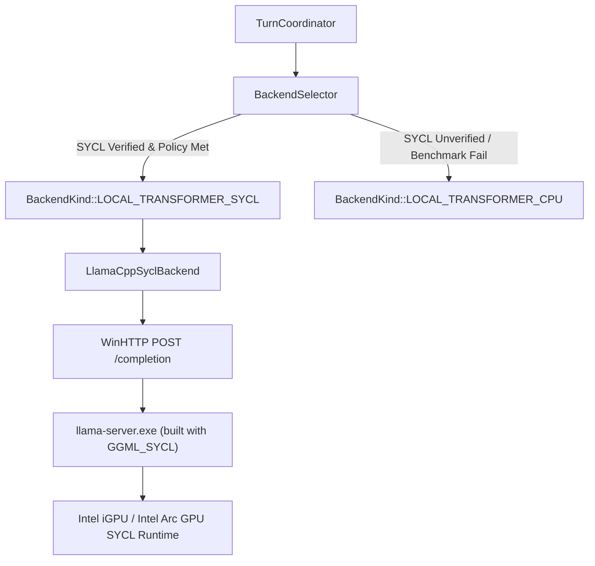

### 27.2 Verification & Routing Gates
$$\text{SYCL\_Active} = \text{IntelGpuPresent} \land \text{SyclRuntimeProbePassed} \land \text{SyclAttestationVerified} \land (\text{RAM}_{\text{avail}} \ge \text{RAM}_{\text{min\_gpu}}) \land (\text{CPU}_{\text{util}} < \text{CPU}_{\text{max\_fg}}) \land (\text{GPU}_{\text{util}} < \text{GPU}_{\text{max\_fg}})$$

### 27.3 Attested Capability & Server Lease Contracts
- **Attestation v2 Schema**: Benchmark SHA-256 fingerprint verification matching model GGUF, `llama-server`, `llama-bench`, device LUID, driver version, and expiration hours.
- **LocalModelServerLease**: Non-destructive attachment to healthy pre-running servers (`attachedToExistingServer = true, ownedByYuki = false`). Only YUKI-spawned processes (`ownedByYuki = true`) are terminated on shutdown.
- **Tri-State BackgroundWorkGovernor**: Evaluates foreground protected, idle-constrained, and idle-healthy modes returning `BackgroundWorkLease` with atomic `cancellationRequested` token.


